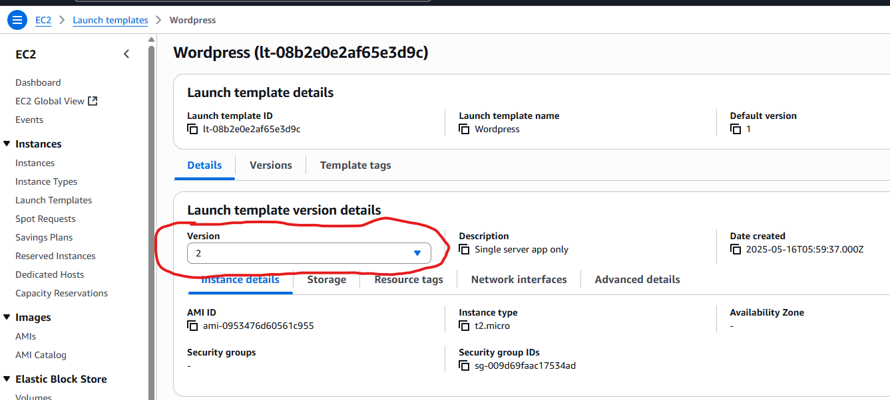
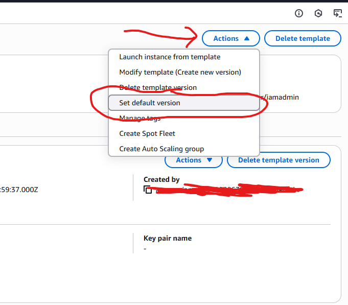

# Auto Scaling Groups

- Handles real time load variations
- Integrates with Load Balancers
- Ensures a minimum and max number of machines running at one time
- Automatically spins up a desired number of instances based on a launch template
- Automatically registers or deregisters instances into a load balancer
  - As you add more instances the ASG will add them to the load balancer registratrion
- Automatically replaces unhealthy instances with healthy ones

### Setup for auto scaling groups:

- ASGs use one launch template which determines what they spin up (ec2 config) - all instances launched for the ASG are based on the single definition of that template
- 3 Main properties: Min size, desired size, max size. Ex: `1:2:4` means 1 min, 2 desired and 4 max
  - ASGs main job is keeping the number of instances at the **desired** number setting.
- Best practice is to set launch options for 3 availability zones (subnets in a VPC). An ASG will be configured to launch instances into configured subnets specified

### Scaling Policies

- Scaling policies are automated and used with metrics such as CPU load, etc.
- Scheduled Scaling - time based for hours that are expected to be busier (business hours), known periods of high orlow usage
- Dynamic Scaling: rules that react to something and change the values on the ASG
  - Simple - a pair of rules, one to provision instances, and one to terminate instances
    - Usually based on a metric, i.e. CPU above 50% or below 50%, adjust the Desired capacity up or down
  - Stepped - i.e. add 3 instances if the CPU usage is above 80%, allows quicker reaction to extreme change in conditions
    - This is preferred over Simple Scaling unless you just need something super simple
  - Target Tracking - define an ideal amount of something, i.e. 40% usage of CPU, and move the desired amount of instances to stay at that level.
- Use Cooldown Periods to prevent extra costs from constantly removing or adding instances if there are lots of changes in the environment
  - Remember you are billed a minimum amount of time each time an instance is provisioned, even if it is terminated quickly

### Definition

- ASGs define where instances are launched.
  - Linked to a VPC
  - Subnets within that VPC and linked to an auto scaling group

### Dynamic Scaling

- auto scale based on rules:
  - Simple - a pair of rules, one to add and one to remove instances \*i.e. CPU utilization. Metrics might need Cloudwatch installed.
  - Step Scaling: set of rules to act depending on how out of normal a metric ist.
    - Set Cloudwatch Alarm for certain CPU usage threshold for a time and when that happens, add a number of instances to desired target
    - Preferrable to Simple scaling in most cases
  - Target Tracking Scaling: Set a CPU usage goal (i.e. 40%) and ASG will automatically add or remove instances to meet and maintain this goal
    - avg network in or out
    - request count per target (relevant to application load balancers)

### Cooldown Period

- Time in seconds - controls how long to wait at the end of a scaling action before doing another.
- Meant to avoid costs with constantly adding instances (since there is a minimum bill for each instance spun up)

### Health checks

- If an instance fails, the ASG will terminate it and provision a new instance to replace it. (Self Healing)
- If you terminate an instance, ASG will auto create a new one to replace it to match desired setting.

### Predictive Scaling:

- Uses machine learning to forecast and predict traffic and scale based on that.
  - useful for predictable time based patterned traffic scenarios

### Simple Instance Recovery

- Cheap simple and effective high availability
- create a launch template to auto build an instance
- Create an Auto Scaling Group using that template
- Set the ASG to use multiple subnets in different Availability Zones
- Set the min, max and desired to 1
- Doing this gives you simple instance recovery
  - Instance recreated on failure or termination
  - Instance can be re-provisioned in another AZ if the original fails.

## Integration with Load Balancers

- Use an ASG to integrate with a target group (associated with a Load Balancer)
  - As instances are provisioned within the ASG, they are automatically added to the Target Group of the Load Balancer
  - Metrics used to monitor load on the system can be used to adjust the number of instances
- Load balancers will be associated with or point to target groups of instances
- The ASG can be configured to use the Load Balancer Health Checks rather than the standard EC2 status checks
  - ALB health checks are much richer and can monitor the http/https requests and be application aware
  - Be careful about health check dependencies, i.e. if you are checking a app part that depends on the database and the database fails, the health check will fail, but the problem isn't the app, it's the database (this will cause ec2 instances to be terminated etc.)

### Elasticity enablement

- As instances from the ASG are provisioned, they will automatically be added to the target group for the load balancer.
- As instances are terminated, then they will be removed from the target group
- This allows for fluid scaling based on metrics as the instances for the load balancer target group are scaled dynamically.

### Load Balancer Health Checks

- ASG can be configured to use the load balancer health checks rather than the EC2 status checks.
- The LB checks are much richer as they can monitor the status of HTTP and HTTPS requests - they are application aware (unlike simple EC2 status checks).
  - Careful about using appropriate health checks: if you just check static HTML, but app has complex other logic that fails, you will not know about that failure
    - Or if you have a check for data from a database in the app, but the database fails, the health check will fail and instances terminated and re-provisioned when the problem is not with the app, but with the database.

## Scaling Processes

- The following functions can be set to "Suspend" or "Resume"

### Functions

- Suspend:
  - Launch - ASG won't scale if alarms fire
  - Terminate - if terminate set to suspend, then no instances will be terminated if alarms go off.
- AddToLoadBalancer: determines if any instances provisioned are added to a load balancer.
- AlarmNotification: Determines if ASG will react to any cloudwatch alarms.
- AZRebalance: determines whether instances are distributed evenly across AZs
- HealthCheck: determines whether health checks on instances are on or off.
- ReplaceUnhealthy: determines if ASG will replace instances marked as unhealthy.
- ScheduledActions: determines if ASG will perform any scheduled actions or not.
- Standby/In Service: Set a specific instance in the ASG to stop all actions if needed. (Maintenance on an instance for example if you need to do that.)

## Cost

- ASGs are Free
- Only costs are for the resources created by the ASG
- Use cooldowns in the ASG to avoid rapid scaling and reduce costs
- \*Use more smaller instances - gives you more granular control of the compute and costs of the ASG.
  - i.e. use 20 small instances instead of 2 large instances. You can increment adding compute in smaller steps etc.

## Launch Configurations and Templates

See [Demo of creating a Launch Template](https://learn.cantrill.io/courses/1101194/lectures/27895186) at timestamp 1:10

- Allows configuration for EC2 instances to be defined in advance
  - Which AMI to use
  - Instance Type and Size
  - What key pair to use
  - Storage, Networking, Security Groups, User Data, IAM Role etc...
- Launch Templates are newer than Launch Configurations and have more features - they are recommended over Launch Configurations
- Not editable - defined once and they're locked
  - Launch Templates allow you to have versions
- Launch Configurations or Launch Templates can be used with Auto Scaling Groups

### Launch Templates

- Can be created from scratch or from previous versions
- When launching an instance directly, you need to specify the keypair and the subnet to launch into in the console
- NOTE: if using a ASG with the template, the ASG will automatically choose which subnet to launch into

## Lifecycle Hooks

- Define custom actions that occur during auto-scaling actions (instance launch transitions or instance terminate transitions)
- Instances are paused and wait with a timeout of 3600 seconds when lifecycle hooks are hooked into
  - They either CONTINUE or ABANDON
  - Or you can RESUME the operation using `CompleteLifeCycleAction` after some activity you want to complete
  - During the wait induced, you can perform a set of actions (load or index data that takes some time for ex.)
  - Moves from `Pending` > `Pending Wait` > `Pending Received` > `InService`
- Can be integrated with Event Bridge or SNS Notifications
- Terminate hooks can be used in reverse, to make a snapshot for ex. before proceeding to terminate
  - `Terminating` > `Terminating Wait` > `Terminating Proceed` > `Terminated`

## ASG Health Checks

- ASGs assess health of EC2 Instances within its group
- If instance fails a health check, then it is replaced in the Auto Scaling Group

### Types of Checks

- EC2 Checks: Anything but running state is viewed as unhealthy: `Stopping`, `Stopped`, `Terminated`, `Shutting Down`, `Impaired` (not 2/2 health status)
- Load Balancer Checks (ELB checks): LB instance needs to be both `Running` and passing the ELB health check, otherwise it is considered unhealthy
  - If using ALB, you can do Application Aware health checks: checking a page in the app, text pattern matching, etc.
  - When integrated with an ASG, these checks are much more Application Aware
- Custom Health Checks: allows integrating external systems to make health checks. Extends functionality of ASG health checks

### Grace Period

- 300 seconds or 5 minutes by default (configurable)
- This is how much time the system has to launch, bootstrap and start before health checks start
  - useful if performing custom bootstrapping on EC2 instances launched by the ASG
- **IMPORTANT** If your grace period is not long enough to let the instance startup, then it will get into an infinite loop of starting and terminating!

### Updating the Version

- If you change a launch template you need to update the default version to use
   
  
   
   

   
  
   
   
