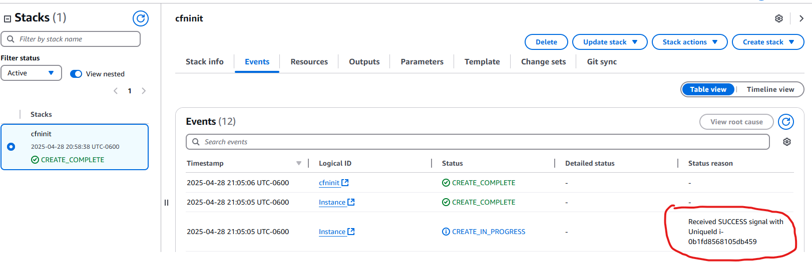
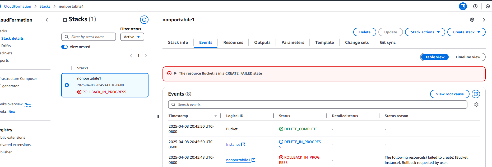
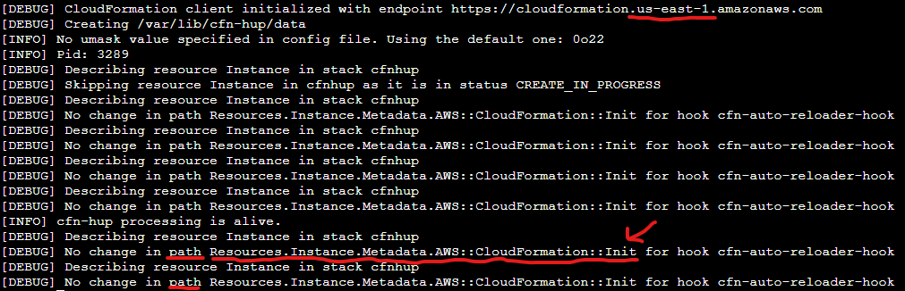
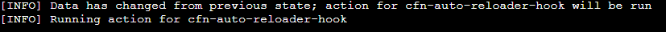
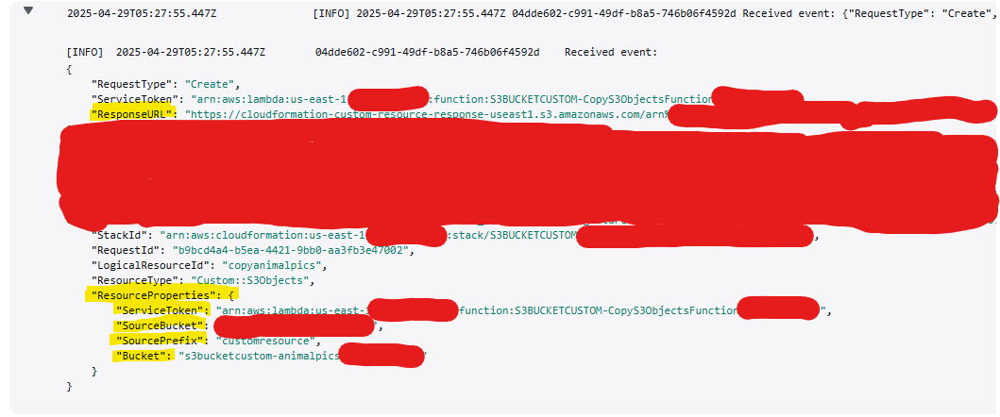
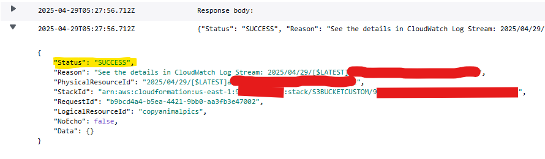

# CloudFormation

- Create update and delete AWS Infrastructure using templates.
- Its purpose is to keep Logical and Physical resources in sync
- Written in YAML or JSON

## Table of Contents

- [Best Practices/Portability](#cloudformation-best-practices)
- [Templates](#components-of-a-template)
  - [Parameters](#template-and-psuedo-parameters)
  - [Complete example using cfn-init cfn-hup and cfn-signal together](#complete-template-example-with-cfn-hup-cfn-init-and-cfn-signal)
- [cfn-init](#cfn-init-cloudformation-init)
- [cfn-hup](#cfn-hup)
- [cfn-signal](#cfn-signal-cloudformation-signals)
- [Change Sets](#change-sets)
- [Conditions](#conditions)
- [Creation Policies](#creation-policies-wait-conditions-cloudformation-signals-cfn-signal)
- [Custom Resources](#custom-resources)
- [Deletion Policies](#deletion-policies)
- [Depends On](#depends-on)
- [Logical Resources](#resources)
- [Mappings](#mappings)
- [Multi-stack Architecture - Stack Sets and Cross-stack References](#multi-stack-architecture)
- [Stack Roles](#cloudformation-stack-roles)
- [Troubleshooting/Debugging](#troubleshooting-cloudformation-issues)

## Components of a Template

### Resources

- **Logical Resources**: What you want to create (not how you want them created)
- CouldFormation Templates create Stacks
  - One template can create many Stacks
  - Templates should be portable - you can use them in many regions and accounts
    - Example of a non-portable template is hard coding a bucket name: the second template creation action will fail because Bucket names are unique!!!
    - Hard coding a AMI Image ID (they are unique per region, so if you move the stack to create in another region, it will fail because the ID does not exist in that region)
    - Use Template or psuedo parameters and do not hard code things!
  - Contained and defined in the `Resources` section of a CloudFormation Template (yaml file)
- The STACK creates physical resources based on the logical resources defined in the template

  - The Stack keeps the physical and logical resources in sync (if the logical resource in the template changes, the stack makes sure the physical resources are updated to it)
  - If the Stack is deleted, the physical resources are also deleted.
  - Once the logical resources enter a Create Complete state, other logical resources can reference physical properties on them (their ID etc.)
  - If the Stack is updated, the physical resources will be added or deleted automatically to keep in sync with it.

- lists resources to create, if they are removed then they are deleted
- The only mandatory part of a template
- Example creating EC2 instance and security group resources:

```yaml
Resources:
  EC2Instance: # Name of the logical resource - you can name this anything you want!
    Type: AWS::EC2::Instance # the physical type of the logical resource
    Properties: # resources will have properties which are what is used to configure them
      InstanceType: "t2.micro"
      ImageId: !Ref LatestAmiId
      IamInstanceProfile: !Ref SessionManagerInstanceProfile
      SecurityGroups:
        - !Ref InstanceSecurityGroup
  InstanceSecurityGroup:
    Type: "AWS::EC2::SecurityGroup"
    Properties:
      GroupDescription: Enable SSH access via port 22 and 80
      SecurityGroupIngress: # allow ports 80 and 22 traffic in
        - IpProtocol: tcp
          FromPort: "22"
          ToPort: "22"
          CidrIp: !Ref SSHandWebLocation # references values elsewhere in the template
        - IpProtocol: tcp
          FromPort: "80"
          ToPort: "80"
          CidrIp: !Ref SSHandWebLocation
```

### Description

- Free text field to add a description of the template
- What the template does, what resources it affects etc. whatever you want the user to know about the template
- The description field must immediately follow the `AwsTemplateFormatVersion` if both fields are used
  - **This is a Exam Trick question!**
- If AwsTemplateFormatVersion is ommitted, then it is assumed.

### Metadata

- specify tags and how the UI displays your template to users

### Parameters

- Apply input, default values etc. to fields
- LatestAmiId: special parameter where you can select the latest version of a particular image (i.e. Linux etc.)

```yaml
Parameters:
  LatestAmiId:
    Type: "AWS::SSM::Parameter::Value<AWS::EC2::Image::Id>"
    Default: "/aws/service/ami-amazon-linux-latest/al2023-ami-kernel-default-x86_64"
```

- SSHandleLocation: specify IP address range to access a resource (i.e. an EC2 instance)

```yaml
SSHandWebLocation:
  Description: The IP address range that can be used to SSH to the EC2 instances
  Type: String
  MinLength: "9"
  MaxLength: "18"
  Default: 0.0.0.0/0
  AllowedPattern: '(\d{1,3})\.(\d{1,3})\.(\d{1,3})\.(\d{1,3})/(\d{1,2})'
  ConstraintDescription: must be a valid IP CIDR range of the form x.x.x.x/x. Default is 0.0.0.0/0 and is less safe.
```

### Mappings

- optional
- allows creation of lookup tables

### Conditions

- Set things only if condition is met
- Requires creating a condition
- Condition is used in resources to determine if they are created etc.

### Outputs

- Once template is finished outputs can be created (show what's created, details about resources modified etc.)
- example outputting details (including using CloudFormation Reference functions)

```yaml
Outputs:
  InstanceId:
    Description: InstanceId of the newly created EC2 instance
    Value: !Ref EC2Instance # cloudformation reference function (references another part of the template)
  AZ:
    Description: Availability Zone of the newly created EC2 instance
    Value: !GetAtt
      - EC2Instance
      - AvailabilityZone
  PublicDNS:
    Description: Public DNSName of the newly created EC2 instance
    Value:
      !GetAtt # function to select attributes of other parts of the template resources
      - EC2Instance
      - PublicDnsName
  PublicIP:
    Description: Public IP address of the newly created EC2 instance
    Value: !GetAtt
      - EC2Instance
      - PublicIp
```

## Template basics

- NOTE: it is rare that you create a template from scratch - usually you will consult resources
  - AWS has a CloudFormation [User Guide](https://docs.aws.amazon.com/AWSCloudFormation/latest/UserGuide/Welcome.html) which includes lots of Template definitions for re-use or examples
    - Type the name of the resource you want to configure in the search box to get examples, etc.
    - Wrapping values in single quotes is safer
- **Logical Resources**: Resources inside a CloudFormation template.
  - i.e. `Instance`
  - have properties that are used to configure them in a certain way
- **Stack**: When a template is given to CloudFormation it creates a stack which contains all the logical resources that the template tells it to contain.
  - The purpose of a Stack is to keep logical and physical resources in sync
  - A stack can contain zero or more other stacks
  - If a stack is deleted then all logical/physical resources are deleted.
- Templates can be stored for change management.

### Goal of CloudFormation Templates:

- For any logical resources in the stack, CloudFormation makes a physical resource in the account.
- The job of CloudFormation is to keep the logical and physical resources in sync all of the time.
- You can take the same template and use it to create multiple stacks that are consistent in configuration
- You can take the same template and create stacks in different regions

## Creating a Template

- Create a stack: AWS Console > CloudFormation > `Create Stack`
  - can use a sample template or create/upload a template
  - Uploaded templates (yaml files etc.) are stored in auto created buckets prefixed with `CF`
  - Click `Next`
- Provide a name (i.e. `cfmytemplate`)
  - Parameters will be set if template has those parameters set, otherwise fill them in
  - click `Next`
- Set advanced Settings if needed and click Next
- Scroll to bottom of next page and check the capabilities warning checkbox and click Submit to run the template.
- Will take a few minutes to create resources, refresh in the console (with UI button) and look for the entire stack (look for the stack name) to say `CREATE_COMPLETE` status.
- You can view the outputs from the template in the Outputs tab

### Deleting a Template

- If you delete a template stack, AWS will delete it and the physical resources specified in it.

## Template and Psuedo Parameters

- Used to prevent hard coding values in templates so the templates remain portabile
- Parameters accept input
  - Input can be provided via the console or CLI when a Stack is updated or created and is used in these parameters
    - Env for the template (Dev, Test, Prod), the Size of the instances, etc.
- Can define constraints or configuration for the parameters:
  - `Defaults`: what to use if input is missing
  - `AllowedValues`: a list of valid inputs, i.e. a list of instance types that are accepted
  - Restrictions such as `Min` and `Max` lengths of input allowed or `AllowedPatterns`
  - `NoEcho` for passwords or secrets to hide the input when it's being typed
  - `Type`: the type of the input - String, Number, List, or AWS specific types (you can populate this so you can have an interactive prompt to choose the type from a list of types)

### Template Parameters Example

```yaml
Parameters: # params go under this section in the template yml
  InstanceType: # name of the parameter
    Type: String # type of the param
    Default: "t3.micro" # define a default if no input
    AllowedValues: # only allow these values for the param
      - "t3.micro"
      - "t3.medium"
      - "t3.large"
    Description: "Pick a supported Instance Type." # could be useful for UI or hint to a user when loaded into the AWS Console UI or console etc.
  InstanceAmiId: # another name of another parameter
    Type: String # this parameter has no validation or restrictions as above so it is free text (anything can be entered for the AMI ID)
    Description: "AMI ID for Instances"
```

### Pseudo Parameters

- [AWS Documentation - Pseudo Parameters](https://docs.aws.amazon.com/AWSCloudFormation/latest/UserGuide/pseudo-parameter-reference.html)
- Provided by AWS (instead of input like Template Parameters above)
  - These parameters exist even if you don't define them and are built-in. They can be referenced in the Template at will. They are injected by AWS into the Template/Stack
    - `AWS:Region` - the value of this always matches whichever region the template is being applied in.
    - `AWS:StackId`: populated with the ID of the Stack being applied
    - `AWS:StackName`: The name of the stack being applied
    - `AWS:AccountId`: populated with the account number the stack is being created in

## CloudFormation Intrinsic Functions

[List of Functions](https://docs.aws.amazon.com/AWSCloudFormation/latest/UserGuide/intrinsic-function-reference.html)

- Allow you to gain access to data at Run Time
  - Allows you to take action based on how things are when a template is being used to create a stack

### Commonly Used Functions

- `Ref` and `Fn:GetAtt` (Get Attribute): Allows you to reference a logical resource from another one
  - Ex: making sure that a subnet goes into a specific VPC, you can reference it
  - Can use `GetAtt` to access Primary and Secondary values returned from logical resources (i.e. their Physical IDs)
- `Fn::Join` and `Fn::Split`: Join or split strings
  - Ex: Can take the name/IP of an EC2 instance to create a web url for people to access it (?)
- `Fn::GetAZs` and `Fn::Select`: Get a list of Availability Zones and Select one from that list (i.e. get AZs from a region and pick one out)
- `IF`, `And`, `Equals`, `Not`, `Or`: Conditionals you can use
  - Ex: If the environment is Production, then deploy a bigger instance type or if Development, then deploy smaller ones etc.
- `Fn::Base65`: Accepts non-encoded text and outputs base64 encoded text
  - Many inputs to AWS need to be in Base64 (ex: user data scripts)
- `Fn::Sub`: Allows you to substitute things in text based on runtime information.
  - Ex: Passing build information into EC2 and you want to provide a value from the Template Parameters
- `Fn::Cidr`: build CIDR ranges for networking
- `Fn::ImportValue`
- `Fn::FindInMap`
- `Fn::Transform`

### Using The Functions

- Place a bang `!` before the function name

#### Ref

- Every logical resource and parameter has a main value that it returns
  - i.e. the main value returned from creating a logical EC2 instance resource is it's ID
  - Note: The Physical ID for a resource is usually returned as its primary value which can be accessed with the `GetAtt` function
  - Some resources have both primary values and secondary values that they return
- The `Ref` function can be used to reference this main value of a parameter or a logical resource

```yaml
Resources:
  Instance:
    Type: "AWS::EC2::Instance"
    Properties:
      ImageId: !Ref LatestAmiId # using ref with a parameter
      InstanceType: "t3.micro"
      KeyName: "A4L"
```

#### GetAtt

- When an instance reaches Create Complete state, it makes available a range of data (including the primary value it returns - it's ID)
- `!GetAtt LogicalResource.Attribute`
  - i.e. `PublicIp` or `PublicDnsName` attributes

#### GetAZs

- Environmental Awareness function - useful for avoiding hard-coding AZ names you want to deploy resources into so that your template is portable
- Ex: get a List of AZ names for a specified region, or use the Region pseudo parameter, or leave the region blank (will default to using the current region used to create the current stack)
  - `!GetAZs "us-east-1"` - returns a list of AZ names that exist in the region
  - **NOTE**: The list of AZs is only those where the Default VPC has subnets in that AZ
    - Normally, this is fine unless you have configured or deleted subnets from your Default VPC (those AZs with no subnets will not be returned in the list!) - also, you NEED a default VPC!
- After retrieving the list, use the `!Select` function to get one from the list returned
  - Accepts a list and a index number (0-based) and will select the numbered index from the list

```yaml
Instance:
  Type: "AWS::EC2::Instance"
  Properties:
    ImageId: !Ref LatestAmiId
    InstanceType: "t3.micro"
    AvailabilityZone: !Select [0, !GetAZs ""] # Get the list, pass it into Select and specify the index
```

#### Split

- Accepts a delimiter to split on and a single string value. Returns a list

```yaml
!Split ["|", "str1|str2|str3|str4"] # returns ["str1", "str2", "str3", "str4"]
```

#### Join

- Accepts a delimiter and a list of values

```yaml
WordpressURL:
  Description: Instance Web  URL
  Value: !Join ["", ["http://", !GetAtt Instance.DNSName]] # returns 'http://dnsname.com
```

#### Base64 with Sub

- Base64 needed for things like user data scripts to convert the plain text to the accepted required base64 encoded text
- Sub can be used to interject parameters into the text by wrapping them in `${paramName}`
  - **YOU CANNOT SELF REFERENCE WITH SUB** - i.e. you can't reference the Instance.InstanceId for example since that resource is not created yet

```yaml
UserData:
  Fn::Base64: !Sub |
    #!/bin/bash -xe
    yum -y update
    yum -y install httpd
    echo "${someParameter}"
```

#### Cidr

- Can reference a CIDR range of a VPC (`!GetAtt VPC.CidrBlock`), tell it how many subnets to allocate and the size of the subnets and you will get an output of a list of CIDR ranges which you can use within subnets within a VPC (this way you don't have to manually allocate the ranges otherwise)
  - Combine this with the `!Select` function to allocate those ranges to subnets individually
- Allows you to assign CIDR ranges to subnets in a automated portable way
- Limitations:
  - Cannot allocate or unallocate ranges (advanced techniques can get around this)
    - Based on the Parent VPC CIDR Range

```yaml
VPC:
  Type: AWS::EC2::VPC
  Properties:
    CidrBlock: "10.16.0.0/16"
Subnet1:
  Type: AWS::EC2::Subnet
  Properties:
    # Pass Cidr function the CIDR range of the VPC, tell it 16 ranges total, with a range size of 12
    # Use Select to pick out the first range returned in the list of possible ranges we can use
    CidrBlock: !Select ["0", !Cidr [!GetAtt VPC.CidrBlock, "16", "12"]]
    VpcId: !Ref VPC
Subnet2:
  Type: AWS::EC2::Subnet
  Properties:
    # for subnet 2 select the second CIDR range we can use from the list
    CidrBlock: !Select ["1", !Cidr [!GetAtt VPC.CidrBlock, "16", "12"]]
    VpcId: !Ref VPC
```

## CloudFormation Mappings

- `Mappings` is a top level key in a CloudFormation template (along with `Resources` and `Parameters` for ex.)
- Useful for making Cloudformation Templates portable
- Contains many mappings of logical resources
  - Each mapping maps keys to values allowing information lookup
  - i.e. map 'Production' environment to a particular database configuration or specific SSH key
- Can have top or second level keys
  - ex: mapping of AMI IDs which have `region` and `architecture` keys
- Use `!FindInMap` instrinsic function to lookup a value in the Mapping
  - `!FindInMap [ MapName, ToplevelKey, SendlevelKey]`
- Typical use case is to store an AMI lookup table you can use to use a particular AMI for a given AWS region and architecture/app/environment type etc.
- Example of `RegionMap` in a cloudformation template under the `Mappings` top level key

```yaml
Mappings:
  RegionMap:
    us-east-1:
      HVM64: "ami-12345"
      HVMG2: "ami-456789"
    us-west-1:
      HVM64: "ami-j1k2j3"
      HVMG2: "ami-udih33"

# Use FindInMap to get the value:
!FindInMap [ "RegionMap", !Ref 'AWS::Region', 'HVM64'] # retrieves the ami id in us-east-1 using HVM64 arch for example
```

### CloudFormation Outputs

- Optional section with information output information about resources created
- Declare values in this section which will be visible as outputs when using the CLI or AWS Console UI
- **Accessible from a parent stack when you use nesting**
- **Can be exported to allow cross-stack referencing of them**

```yaml
Outputs:
  WordPressURL: # define an output (you name this)
    Description: "Instance Web URL" # Description is visible in the CLI/UI Console and passed back to the parent stack when nesting is used
    Value: !Join ["", ["https://", !GetAtt Instance.DNSName]] # Value is what you want to be exposed by the stack once it is in a Create Complete state. This allows us to access the url that was created from this template
```

## CloudFormation Best Practices

- Where possible do not name anything in your template to keep it portable
  - **Allow AWS to create Physical resource IDs and names for you**
- Do not use anything Regional Specific - AMI IDs or key names (get these as parameter values with a suitable default to start with)
- Use built in CloudFormation references to dynamically get latest and regional appropriate values automatically

```yaml
Resources:
  Bucket:
    Type: "AWS::S3::Bucket"
    Properties:
      BucketName: "accatpics1333333337" # BAD: not Poratable!
  Instance:
    Type: "AWS::EC2::Instance"
    Properties:
      InstanceType: "t2.micro"
      ImageId: "ami-090fa75af13c156b4" # Bad: do not provide specific IDs to your template
```

```yaml
Parameters:
  LatestAmiId: # Parameter name referenced under Instance block
    Description: "AMI for EC2"
    Type: "AWS::SSM::Parameter::Value<AWS::EC2::Image::Id>" # GOOD: provide Defaults and reference Parameters (can be set by users or fallback to default defined below)
    Default: "/aws/service/ami-amazon-linux-latest/amzn2-ami-hvm-x86_64-gp2" # Good Practice to include defaults so user does not have to input parameters
Resources:
  Bucket:
    Type: "AWS::S3::Bucket" # GOOD: Do not specify a bucket name, leave Properties.BucketName out and let AWS create a physical resource name/ID for you automatically!
  Instance:
    Type: "AWS::EC2::Instance"
    Properties:
      InstanceType: "t2.micro"
      ImageId: !Ref "LatestAmiId" # This will give you a physical ID as defined in the LatestAMIId default above, for example, for the latest AMazon AMI in the region you are creating the stack in
```

## CloudFormation Conditions

- Allows you to deploy what resources are created and how they're created based on conditions
  - PROD or DEV environments, etc.
  - Whether a parameter passed in is a certain value
- part of the optional `Conditions` section of a cloudformation template
- Conditions are evaluated in the end as TRUE or FALSE
- Conditions are evaluated BEFORE logical and physical resources are created in a CloudFormation template process
  - Conditions are evaluated first and any resources that reference those conditions will be influenced
  - Any logical resource can have a Condition associated with them and that condition decides whether they are created or not, if the condition is TRUE or FALSE
- Conditions can be nested and evaluate to TRUE or FALSE depending on whether other conditions are TRUE or FALSE

### The Condition Functions

- `AND`
- `EQUALS`
- `IF`
- `NOT`
- `OR`

### Condition example

- 3 components to using conditions: Parameters, Conditions, Resources.Condition

```yaml
# Parameter to use for the condition
Parameters:
  EnvType:
    Default: "dev"
    Type: String
    AllowedValued:
      - "dev"
      - "prod"

# Conditions
Conditions:
  IsProd: !Equals # name the condition and use an intrinsic function
    - !Ref EnvType # reference the parameter value
    - "prod" # specify EnvType must equal 'prod' for this condition to return True

# Resources.condition:
Resources:
  Wordpress: # this resource has no condition so it is ALWAYS created regardless
    Type: "AWS::EC2::Instance"
    Properties:
      ImageId: "ami-12345"
  Wordpress2:
    Type: "AWS::EC2::Instance"
    Condition: IsProd # reference the condition name - this resource will be created if TRUE
    Properties:
      ImageId: "ami-12345"
```

## Depends On

- By default, CloudFormation tries to create, update and delete resources in Parallel
- The order of dependencies is inferred initially based on references
  - If a EC2 instance references a Subnet and a Subnet references a VPC, it knows to create the VPC first, then the subnet and then the EC2 instance
  - **You cannot reference a resource until it's in a create complete state**, so if there are `!Ref` entries then CloudFormation assumes those resources ref'd must be created first - **implicit dependency**
- `DependsOn` allows you to explicitly tell CloudFormation to wait on creating resources if they depend on others

### Common use case for DependsOn

- Most of the time, the **implicit dependency** order works in CloudFormation, but there are some cases where it doesn't
- Common case is creating an Elastic IP associated with a EC2 instance in a subnet - this requires an Internet Gateway to be created FIRST
  - This can cause cases where creating or deleting stacks sometimes works and sometimes it doesn't
  - If the Elastic IP is created before the Internet Gateway attachment is created, you'll get an error
- You need to explicitly define `DependsOn` in this scenario to avoid random errors due to the random parallel creation order
  - This will not only gaurantee correct order in creation, but also in updating and deleting in the correct order
  - Note: you can have a list of DependsOn resources or a single resource specified

```yaml
WPEIP:
  Type: AWS::EC2::EIP
  DependsOn: InternetGatewayAttachment # Explicitly depend on the internet gateway attachment being created
  Properties:
    InstanceId: !Ref WordPressEC2
InternetGatewayAttachment: # definition of what EIP depends on
  Type: "AWS::EC2::VPCGatewayAttachment"
  Properties:
    VpcId: !Ref VPC
    IntergetGatewayId: !Ref InternetGateway
VPC: # referenced with !Ref, so implicit dependency and will be created before InternetGatewayAttachment
  ...
InternetGateway: # referenced with !Ref, so will be created before InternetGatewayAttachment
  ...
```

## Creation Policies, Wait Conditions, CloudFormation Signals (cfn-signal)

- When a logical resource is provisioned initially it goes into a **CREATE_COMPLETE** state and tells CloudFormation that it is created.
  - The resource may have to perform further bootstrapping processes (custom bootstrapping or user-data scripts, etc.) in order to be in a true complete state, though, but there is no built-in way to tell CloudFormation about when that is done
- Creation Policies, Wait Conditions and cfn-signals allow us to send more signals to Cloudformation to tell it whether the resource really is done and in a create complete state or not.
- Generally recommended to use CreationPolicies over WaitConditions since they are simpler to manage, but sometimes you need the extra functionality of WaitConditions

### cfn-signal (CloudFormation Signals)

[DEMO](https://learn.cantrill.io/courses/1101194/lectures/28333069) at timestamp 10:00

- Sent via the `cfn-signal` command (included in the aws-cfn-bootstrap package)
- Configures cloudformation to pause/hold depending on a certain number of `success` signals
- Can configure a logical resource to wait for a Timeout - `Hours:Minutes:Seconds` - 12 hour max - during which those signals can be received
- If the number of success signals is received within the Timeout period, the status of the logical resource changes to `CREATE_COMPLETE`
  - You configure `cfn-signal` utility on an instance to send these signals to CloudFormation
- If a Failure signal is sent or timeout is exceeded, then the entire stack fails
- The thing being signaled is a logical resource (EC2, Autoscaling groups, etc.) using a CreatePolicy or a WaitCondition

#### Use Case for cfn-signal

- Explicitly notify CloudFormation that userdata bootstrapping is complete by sending a signal with the tool via a command: `/opt/aws/bin/cfn-signal -e $? --stack ${AWS::StackName} --resource AutoScalingGroup --region ${AWS::Region}`
- This helps UX because when you launch a template, the EC2 instance will go into a running state before bootstrapping completes and if bootstrapping takes a longer time, the site will be down during that time.
- The signal will cause CloudFormation to wait until the signal is received and only then will it move into a CREATE_COMPLETE state and resources are ready for service

```yaml
Instance:
  Type: "AWS::EC2::Instance"
  CreationPolicy: # creates an endpoint to be signaled when the instance is really in a created state (after all bootstrapping is done)
    ResourceSignal:
      Timeout: PT15M # Expects a signal and will wait 15 minutes for a success signal via cfn-signal, after which the signal is considered failed
  Properties:
    InstanceType: "t2.micro"
    ImageId: !Ref "LatestAmiId"
    SecurityGroupIds:
      - !Ref InstanceSecurityGroup
    Tags:
      - Key: Name
        Value: A4L-UserData Test
    UserData:
      Fn::Base64: !Sub |
        #!/bin/bash -xe
        yum -y update
        yum -y upgrade
        # simulate some other processes here
        sleep 300
        # Continue
        yum install -y httpd
        systemctl enable httpd
        systemctl start httpd
        echo "<html><head><title>Amazing test page</title></head><body><h1><center>${Message}</center></h1></body></html>" > /var/www/html/index.html
        /opt/aws/bin/cfn-signal -e $? --stack ${AWS::StackId} --resource Instance --region ${AWS::Region}
      # THIS IS SENDING THE SIGNAL ^
```

- After sending the signal, you will see the SUCCESS message in the Events tab in CloudFormation details page:
  <br>
  
  <br>
  <br>

#### Creation Policy vs. Wait Condition

- separate logical resource called a WaitCondition resource
  - For signaling EC2 instances, you should use a `CreationPolicy` since it's tied to a specific resource
- If you have other requirements to signal outside of a specific resource (integrating CloudFormation with an external IT system), then use a `WaitCondition`

### Creation Policy Example

- Autoscaling Group that depends on 3 EC2 instances being finished bootstrapping (installing the application, etc):

```yaml
AutoScalingGroup:
  Type: AWS::AutoScaling::AutoScalingGroup
  Properties:
    ...
  DesiredCapacity: '3' # ASG for 3 EC2 instances - they all need to be ready before moving the ASG into CREATE_COMPLETE state
  MinSize: '1'
  MaxSize: '4'
  CreationPolicy: # Creation policy directive
    ResourceSignal:
      Count: '3' # how many success signals are required - matches num EC2 instances desired
      Timeout: PT15M # timeout of 15 minutes

# The EC2 instances
LaunchConfig:
  Type: AWS::AutoScaling::LaunchConfiguration
  Properties:
    ...
    UserData: "Fn::Base64": !Sub |
      #!/bin/bash -xe
      yum update -y aws-cfn-bootstrap # install/update the package that comes with cfn-signal
      (...your bootstrapping stuff...)
      # Send the signal with the cfn-signal utility:
      /opt/aws/bin/cfn-signal -e $? --stack ${AWS::StackName} --resource AutoScalingGroup --region ${AWS::Region}
```

### WaitCondition example

- A `WaitCondition` is a logical resource, not something defined in another resource
- A `WaitCondition` can depend on other resources, or other resources can depend on it
- Useful as a more general gate which can't be passed until signals are received
  - A `WaitCondition` will not proceed to CREATE_COMPLETE until it gets signals or timeout reached
- WaitCondition relies on a `WaitHandle` which is another logical resource
  - the `WaitHandle`'s sole purpose is to generate a pre-signed URL which is used to send signals to
  - It's pre-signed so that whatever is using it does not need to use any AWS credentials (they're included in the pre-signed URL)
- You can pass back a generated JSON file, or whatever data to the pre-signed URL created by the `WaitHandle` as the signal
  - **NOTE**: The data passed back can be referenced in the CloudFormation template using the `!GetAtt` function to query the `WaitCondition` resource to get details from it: `!GetAtt WaitCondition.Data` gets the Data property from the JSON object sent back as part of the signal
    - This allows data exchange from whatever is signaling between it and the CloudFormation stack to get additional information about the event from the external system, for ex.
- Used if you want to pass data back to CloudFormation or want to put general Wait Statements into your template until a signal is received.

```yaml
WaitHandle: # makes a pre-signed url to send data/signal to
  Type: AWS::CloudFormation::WaitConditionHandle
WaitCondition:
  Type: AWS::CloudFormation::WaitCondition
  DependsOn: "someresource"
  Properties:
    Handle: !Ref "WaitHandle" # reference the WaitHandle
    Timeout: "300"
    Count: "1" # wait for one success signal
```

# Multi-stack Architecture

- All resources within one CloudFormation stack share a life cycle - they are all created together, updated together and they are all deleted together
- There are limits for a stack
  - Max of 500 resources per stack
  - A stack is by design **isolated** - if you create a VPC in a stack it's not practical to reference it in another stack
- For complex projects you will need to use multiple stacks - there are two ways to do this: Nested and Cross-stack references

## CloudFormation Nested Stacks

### The Root Stack

- Start with one stack the **ROOT STACK**
- The root stack is the parent stack and the only stack that is created manually by a entity (i.e. a IAM user or software process, etc.)
  - Parent Stack: a stack which is the parent of any stack which it immediately creates
  - a way to refer to any stack that has nested stacks under it. The root stack is also a parent stack
- The Root Stack can have parameters and outputs
- A nested stack is another logical resource in the CloudFormation template:

```yaml
VPCSTACK:
  Type: AWS::CloudFormation::Stack # the type of logical resource for a nested stack
  Properties:
    Template: https://someurl.com/template.yml # normal cloudformation template with it's own logical resources, etc.
    Parameters: # provide parameters to the nested stack template if needed - this passes them to it
      Param1: !Ref SomeParam1
      Param2: !Ref SomeParam2
```

- when the nested stack moves into a CREATE_COMPLETE state, any output is returned to the root stack
  - These are referenced in the root stack with `VPCSTACK.Outputs.someoutput`
  - You can only reference Outputs in nested stacks, you can't reference any of the logical resources created in the nested stacks

### Why use Nested Stacks

- **Use Nested Stacks when everything is lifecycle linked** (everything needs to be created, updated and deleted together)
  - If you anticipate needing one part long term and another short term, then do NOT use Nested Stacks!
  - If you need to make changes to one part of the application, but not another, then do NOT use Nested Stacks, better to have individual non-nested stacks in that case
- Breaking up resources into modular templates means that they can be reused
  - For example, a VPC Stack could probably be reused by many other deployments, so you can updload it somewhere and reference its url as a nested stack in many other templates
  - **This means you are re-using the Infrastructure Code in the template, NOT the stack itself, i.e. the same physical VPC etc.**. If you need to use the same VPC across stacks, then cross-reference stacks are the better option
- The main reason is to reuse templates to create new physical resources from them
- Also useful to overcome the 500 resource limit for one stack if you need more than that

## Cross-Stack References

- Used when you want to reuse resources from one stack in other stacks and reference them (i.e. the same VPC, for example from another stack)
- Normally, outputs from stacks are only visible in a user interface or command line - you can't use !Ref to reference anything from one stack in another
- Useful when you have one long running resource like a VPC, but other short-lived resources that want to use that VPC (so they are not lifecycle linked)

### Exporting Outputs

- You can export Outputs from a stack which makes them visible to other stacks
  - The outputs are put under an Export Name in an exports list in one region of your account (every region has an exports list)
  - The export name must be unique per region of your account
  - Cross-region referencing is not supported
- Use `Fn:ImportValue` with the `Ref` function to get the exports by name

```yaml
Outputs:
  SHAREDVPCID:
    Description: Shared Services VPC
    Value: !Ref VPC
    Exports:
      Name: SHAREDVPCID # Reference the logical resource in this stack to export
```

```yaml
!ImportValue SharedVPCID
```

### Use cases for Cross-Stack References

- Service Oriented Architectures - where you have to provide resources from one stack to another
- Short-lived parts of an application which all consume from a shared services VPC
- When you have long and short life cycled resources which you want to separate into different stacks
- Used when you want to reuse resources themselves, not just the template as in Nested Stacks

## Stack Sets

Allows you to Deploy and manage, delete or update many stacks in many regions across many different AWS accounts.

- Prevents you having to switch accounts and regions and authenticate, etc.
- Stack Sets are treated separately from stacks
  - If a stack fails to create, the stack instance will remain to keep a record of what happened (why the stack failed to create)

### Stack Instances

- Stack Sets contain Stack Instances which reference stacks which run in a particular region and AWS account
  - you can think of a Stack Instance as a conatiner for an individual stack
- The Stack Instances are containers which record what happens in each stack that's created in each stack of the Stack Set

### Target Accounts

- Stack instances and stacks are create in **Target Accounts**
  - Target accounts are AWS Accounts which stack sets target to deploy resources into
- A stack set is of an Admin Account which references Stack Instances and Stacks which are in target accounts and regions you choose
- The stacks created by a Stack Set are normal stacks in one region or account. The Stack Set uses a self-managed or service-managed Role to create these stacks across multiple regions or accounts on your behalf
  - Service managed Roles are used in conjuction with AWS Organizations. This is less overhead and lets the product manage the role/permissions for you over self-managed roles
- When setting up a stack set, you indicate with Organization Units or AWS Accounts you want to use as Targets, you specify the regions and then CloudFormation will interact with those accounts using Role permissions.
  - Will create Stack Instances within each region and target account you specify
    - One stack per region specified in each target account

### Stack Set Configuration Options

- `Term: Concurrent Accounts`: defines how many accounts you can deploy into at one time. If you have 10 stacks across 10 accounts and you set this to `2`, then that means there will be 5 sets of deployments. The higher you set this, the faster the deployment (in theory)
- `Term: Failure Tolerance`: the number of stacks that can fail before the entire Stack Set is considered failed.
- `Term: Retain Stacks`: By default if you remove stack instances from a Stack Set, these stacks will be deleted. You can use this option to override that behavior and retain stacks even if they are removed from the Set.

### Use Cases for Stack Sets

- Enabling AWS configuration across a large range of AWS Accounts
- Configuring config rules like MFA Authentication, Elastic IPs or EBS Encryption
- Create IAM Roles for cross-account access at scale - instead of having to create these in individual accounts one by one, you can define a CloudFormation template to create an IAM role, and then deploy it as part of a Stack Set

## Deletion Policies

- By default, if you remove a logical resource from a template and then deploy that stack, that resource will be deleted
  - This default behavior can cause data loss in some instances (i.e. if you are deleting RDS databases or EC2 instances with attached EBS Volumes)
- You can apply a deletion policy on a resource to specify an action that should be taken when that resource is being deleted
  - `Delete`: the default action which is to delete the physical resource
  - `Retain`: CloudFormation will not delete the resource if the corresponding logical resource is removed
  - `Snapshot`: supported for resources like EBS Volumes, Elasticache, Neptune, RDS, RedShift. Will take a snapshot of the resource before it's deleted.
    - NOTE: the snapshots exceed the stack lifetime, so you need to clean them up manually if you don't want them to remain and incur storage costs

#### IMPORTANT: Deletion policies only apply to Delete actions

- Delete actions are only:
  - The logical resource is removed from the stack template and then you apply that change the stack
  - The stack is deleted
- If you subtley CHANGE the logical resource instead of removing it or deleting the stack, that is a **REPLACE** operation and **the Deletion policy WILL NOT APPLY**!
  - Data for that resource will be LOST in this case and even a delete policy of retain/snapshot etc. will not be applied

## CloudFormation Stack Roles

- By default, Cloudformation uses the permissions of the Identity of the logged in user to create the resources in the Stack.
  - Note: AWS has zero permissions as a starting point
- So, your user needs permissions to:
  - Create, Update or Delete Stacks
  - Create, Update or Delete any resources in the stacks
- This can be problematic because usually there are some teams that can create resources and separate teams which are allowed to update those resources
- Stack Roles allow CloudFormation to assume a role which allows it to create, delete or update resources
- Role Separation
  - One team can create Stacks, and the permission sets required to implement them
  - The entity creating, updating or modifying a stack only needs permissions on that stack and hte `PassRole` permissions
  - so for role separation, for example, an identity that's interacting with a stack using Stack Roles does not need the permissions to interact directly with the resources themselves.
    - This means that a non-admin user could be given permissions to interact with a stack using a role which would still not allow them to interact or modify the actual resources in that stack

### Use Case

- This is useful if users who need to use CloudFormation to do things that they wouldn't otherwise be allowed to do outside of CloudFormation, Stack Roles are a great solution to allow this.
- You can have an Admin IAM user provision a role with the permissions required, and then give the identity with reduced access only the rights to pass that role into CloudFormation in combination with the permissions to interact with Stacks in CloudFormation and then they can perform actions on the AWS account in a safe and controlled way that they otherwise wouldn't have permissions to do.

## cfn-init (CloudFormation Init)

- A helper tool that runs on EC2 instances during bootstrapping.
- This loads metadata stored from a logical resource in a cloudformation stack. It applies a desired state to an EC2 instance based on the metadata of that instance's resource
- ONLY RUN ONCE!!!

  - If you change the Cloudformation template and update the stack, cfn-init is NOT RERUN and the configuration is not re-applied!

- Configuration management system which is a CloudFormation native feature separate from something like user data scripts, which has configuration directives stored in a CloudFormation template
- `AWS::CloudFormation::Init` part of a logical resource
  - Here, you can specify what you want to happen on an instance
- The main difference between User Data script and `Cloudformation::Init` is that User Data is procedural - you are specifying HOW you want things to be done
  - CloudFormation::Init is a **Desired State** - WHAT you want to occur, not HOW
  - Only applies changes to the previous state on updates, not the whole thing again
  - This means that it can be CROSS-PLATFORM and work across different flavors of Linux or even Windows
  - CloudFormation::Init is **idempotent** - if it is already in the desired state, CloudFormation will leave it in that state. (i.e. if you specify to install Apache, but Apache is already installed, then nothing will happen) - this cuts off the need to define logic for what would happen if something is already the case as you would in custom scripts.

### the tool

- Accessing the CloudFormation::Init data is done via a helper script called `cfn-init`
  - This is installed within the EC2 operating systems.
  - Executed via User Data script
- Generally pointed to a logical resource name, generally the EC2 instance that it is running on, loads the configuration directives and makes them execute and so
- The cfn-init configuration is stored under the `MetaData.AWS::CloudFormation::Init` block in the template
- Example: a logical resource, such as an EC2 instance, will have a special `MetaData` component:

```yaml
EC2Instance:
  Type: AWS::EC2::Instance
  CreationPolicy: ...
  MetaData: # special Metadata property on a logical resource
    AWS::CloudFormation::Init: # Where the config directives are stored under
      configSets: ... # you can pick from keys listed below and bundle them into a config set which defines which config keys to use and in which order
      # Config Keys:
      install_cfn: ... # These keys are containers of configuration directives which contain the same sections
      packages: # which packages to install
      groups: # directives to control local group management on the instance operation system
      users: # define directives for local user management
      sources: # define archives which can be downloaded and extracted
      files: # allows us to configure files to create on the local operating system
      commands: # specify commands we want to execute
      services: # define services which should be enabled on the operating system
      software_install: ...
      install_wordpress: ...
      configure_wordpress: ...
```

#### Complete example with cfn-init directives filled in:

```yaml
Instance: # Instance - the name of this logical resource referenced in cfn-init
  Type: "AWS::EC2::Instance"
  Metadata: # Property for metadata we use for cfn-init
    "AWS::CloudFormation::Init": # THIS IS A DESIRED STATE CONFIGURATION tool - alternative way to bootstrap
      config: # under config are the configuration directives used by cfn-init
        packages: # under packages init will install any packages listed here
          yum:
            httpd: []
        files: # init creates any files contained within this files section
          /var/www/html/index.html: # file path
            content: !Sub |
              <html><head><title>Amazing test page</title></head><body><h1><center>${Message}</center></h1></body></html>
        commands: # init runs any commands in this section
          simulatebootstrap:
            command: "sleep 300"
        services: # cfn-init adjusts the configuration of services specified in this section
          sysvinit:
            httpd:
              enabled: "true" # makes sure the service starts when the instance restarts
              ensureRunning: "true" # makes sure service is running
              files:
                - "/var/www/html/index.html"
  CreationPolicy:
    ResourceSignal:
      Timeout: PT15M
  Properties:
    InstanceType: "t2.micro"
    ImageId: !Ref "LatestAmiId"
    SecurityGroupIds:
      - !Ref InstanceSecurityGroup
    Tags:
      - Key: Name
        Value: A4L-UserData Test
    UserData: # in here is the cfn-init command where pass in the stack, the resource and the region to it. The cfn-init command applies the desired state defined above
      Fn::Base64: !Sub |
        #!/bin/bash -xe
        echo "running cfn-init below..."
        /opt/aws/bin/cfn-init -v --stack ${AWS::StackId} --resource Instance --region ${AWS::Region}
        echo "done with cfn-init bootstrapping, send a success signal with cfn-signal based on the status code returned of cfn-init run above..."
        /opt/aws/bin/cfn-signal -e $? --stack ${AWS::StackId} --resource Instance --region ${AWS::Region}
```

### cfn-init helper tool

- the tool is executed from the EC2 user data script
- We use `cfn-init` command line directive to execute the configuration (keeping the user data script minimal) and `cfn-signal` to signal that the Cloudformation Init is complete
- The variables `AWS::StackId` and `AWS::Region` are replaced with the actual values automatically becauce the instance is being created by CloudFormation
  - The region is the region that the stack is created in and the StackId is the id of the stack we're currently using - these are automatically passed to the `cfn-init` helper tool (they are passed in via User Data by CloudFormation)

```yaml
UserData: # cloudformation init directives happen inside User Data Script
  Fn::Base64: !Sub |
    #!/bin/bash -xe
    yum -y update
    /opt/aws/bin/cf-init -v --stack ${AWS::StackId} --resource EC2Instance --configsets <configSet to use: wordpress_install> --region ${AWS::Region}
    /opt/aws/bin/cfn-signal -e $? --stack ${AWS::StackId} --resource EC2Instance --region ${AWS::Region}
```

- Note: this command: ` /opt/aws/bin/cf-init -v --stack ${AWS::StackId} --resource EC2Instance --configsets wordpress_install --region ${AWS::Region}` uses a specific config set called `wordpress_install` which uses all the config keys defined in the above template example:

```
install_cfn,
packages,
groups,
users,
sources,
files,
commands,
services,
software_install,
install_wordpress,
configure_wordpress
```

## cfn-hup

- Used together with `cfn-init` any update stack operations which change the metadata can also update the EC2 instance's operating system configuration
- A helper tool (daemon) that can be installed on an EC2 instance
- You are responsible for installing and configuring it, but that can be handled with any other configuration that is normally done during the bootstrapping process when the instance is launched.
- `cfn-hup` is pointed at a logical resource in a stack and it monitors it to detect changes in the resource's metadata
  - Changes occur when you update the template (change the metadata and then perform an Update Stack operation)
  - When a change is detected, `cfn-hup` can run configurable actions (for example, you could re-run `cfn-init` to reapply the instances desired state - since `cfn-init` only runs once by default)

### Usage

- Install `cfn-init` and `cfn-hup` on an instance as part of the bootstrapping process
- Configure `cfn-hup` to monitor the logical resource for that instance
- `cfn-hup` monitors periodically for changes in the metadata for that resource
- Change a template userdata script and run a `UpdateStack` operation
- `cfn-hup` will detect a change and we have configured it to run `cfn-init` which downloads the new metadata for that instance and applies the new configuration
  - For example if you updated the metadata/cfn-init to install a new application or software
  - Userdata by default is not run again on update operations - it is run once during launch, so if you need to run init setup/bootstrapping again, this is how you do it with cfn-hup.

### Note on Updates

- [Docs AWS](https://docs.aws.amazon.com/AWSCloudFormation/latest/UserGuide/using-cfn-updating-stacks-update-behaviors.html)
- **Update with Disruption**: When the stack is updated and the instance is automatically stopped and started.
  - This can occur if you reference a Parameter in a userdata script for example in the template and update the Parameter via a StackUpdate operation. The instance will stop (it loses its IPv4 address) and start

### Complete template example with cfn-hup, cfn-init and cfn-signal

```yaml
Parameters: # if these change, because they're referenced in the bootstrapping metadata, cfn-hup will detect it and run cfn-init again to bootstrap with the updated metadata (otherwise userdata only runs once)
  LatestAmiId:
    Description: "AMI for EC2"
    Type: "AWS::SSM::Parameter::Value<AWS::EC2::Image::Id>"
    Default: "/aws/service/ami-amazon-linux-latest/amzn2-ami-hvm-x86_64-gp2"
  Message:
    Description: "Message for HTML page"
    Default: "Cats are the best"
    Type: "String"
Resources:
  InstanceSecurityGroup:
    Type: "AWS::EC2::SecurityGroup"
    Properties:
      GroupDescription: Enable SSH and HTTP access via port 22 IPv4 & port 80 IPv4
      SecurityGroupIngress:
        - Description: "Allow SSH IPv4 IN"
          IpProtocol: tcp
          FromPort: "22"
          ToPort: "22"
          CidrIp: "0.0.0.0/0"
        - Description: "Allow HTTP IPv4 IN"
          IpProtocol: tcp
          FromPort: "80"
          ToPort: "80"
          CidrIp: "0.0.0.0/0"
  Bucket:
    Type: "AWS::S3::Bucket"
  Instance:
    Type: "AWS::EC2::Instance"
    Metadata:
      "AWS::CloudFormation::Init": # Using cfn-init helper to define a desired state to bootstrap to
        config: # configuration directives for cfn-init
          packages:
            yum:
              httpd: []
          files: # create config files to configure cfn-hup
            /etc/cfn/cfn-hup.conf: # creating cfn-hup config file to use for cfn-hup to monitor updates and run cfn-init on changes again
              # specify the stack, region and interval in minutes for how often cfn-hup checks for configuration changes
              content: !Sub |
                [main]
                stack=${AWS::StackName}
                region=${AWS::Region}
                interval=1
                verbose=true
              mode: "000400" # set permissions for the conf file
              owner: "root"
              group: "root"
            # In this second configuration file created, we define what should happen when an update occurs:
            # The `triggers` is when the stack is updated, the `path` is the metadata it's monitoring for changes, and `action` is what happens on a detected change to the metadata occurs
            # the action just runs cfn-init again to redo bootstrapping with the updated metadata
            /etc/cfn/hooks.d/cfn-auto-reloader.conf:
              content: !Sub |
                [cfn-auto-reloader-hook]
                triggers=post.update
                path=Resources.Instance.Metadata.AWS::CloudFormation::Init
                action=/opt/aws/bin/cfn-init -v --stack ${AWS::StackId} --resource Instance --region ${AWS::Region}
                runas=root
              mode: "000400"
              owner: "root"
              group: "root"
            /var/www/html/index.html:
              content: !Sub |
                <html><head><title>Amazing test page</title></head><body><h1><center>${Message}</center></h1></body></html>
          commands:
            simulatebootstrap:
              command: "sleep 300"
          services:
            sysvinit:
              cfn-hup:
                enabled: "true" # make sure cfn-hup starts when instance boots every time
                ensureRunning: "true"
                files: # point to the configuration files for this service you created above
                  - /etc/cfn/cfn-hup.conf
                  - /etc/cfn/hooks.d/cfn-auto-reloader.conf
              httpd:
                enabled: "true"
                ensureRunning: "true"
                files:
                  - "/var/www/html/index.html"
    CreationPolicy: # creation policy to wait for 15 minutes for a success signal from cfn-signal or fail the stack
      ResourceSignal:
        Timeout: PT15M
    Properties:
      InstanceType: "t2.micro"
      ImageId: !Ref "LatestAmiId"
      SecurityGroupIds:
        - !Ref InstanceSecurityGroup
      Tags:
        - Key: Name
          Value: UserData Test
      UserData: # Userdata calls cfn-init and cfn-signal to signal when bootstrapping is complete and the stack can go to CREATE_COMPLETE status ready for service
        Fn::Base64: !Sub |
          #!/bin/bash -xe
          /opt/aws/bin/cfn-init -v --stack ${AWS::StackId} --resource Instance --region ${AWS::Region}
          /opt/aws/bin/cfn-signal -e $? --stack ${AWS::StackId} --resource Instance --region ${AWS::Region}
```

<a name="troubleshooting"></a>

# Troubleshooting CloudFormation issues

- To find errors in the CloudFormation process, in the CloudFormation dashboard/page, click the Events Tab and then click the L9ogical ID (Stack name) > Click the Events tab and look at the Status reason column for the time you want to see what failed.
- 
- `sudo cat /var/log/cloud-init-output.log`: useful for normal bootstrapping with userdata - shows the userdata script output that ran during bootstrapping
  - Will show full output of errors during bootstrapping if you're using userdata directly (not `cfn-init` tool)
- `sudo cat /var/log/cfn-init-cmd.log`: shows bootstrapping output from using `cfn-init` tool
  - This will give you good output of the bootstrapping process if there were problems if you are using `cfn-init` tool instead of userdata directly
- `sudo cat /var/log/cfn-init.log`: shows you granular overview of which desired state actions took place using `cfn-init` config directives (installing software, creating files, etc.)
- `sudo cat /var/log/cfn-hup.log`: shows output of cfn-hup setup
  - Will show the region it initializes with
  - Will show what path is being monitored (will match up with section in yaml template `Instance.Metadata.AWS::CloudFormation::Init`)
    <br>
    
    <br>
    <br>

```yaml
Instance:
  Type: "AWS::EC2::Instance"
  Metadata:
    "AWS::CloudFormation::Init": # matches this path Instance.Metadata.AWS::CloudFormation::Init
      config:
```

- You can see cfn-hup changes by tailing -f the cfn-hup.log file and waiting for a change to be triggered if you update the metadata and update the stack:
  - Run `sudo tail -f /var/log/cfn-hup.log`
    <br>
    
    <br>
    <br>
  - Run `sudo cat /var/log/cfn-init.log` to see the changes made in cfn-init (it is a desired state tool, so only the changes from the previous state will be updated and applied leaving the rest of the state as is)

# Change Sets

Useful for rigorous change management within a business.

### The types of change behavior

- No Interruption: no services are interrupted
- Some Interruption: like an EC2 instance rebooting, can impact service but not servere
- Replacement: A new copy of the physical resource is created and the old one is removed.
  - **This is the most disruptive and can result in data loss**

### Where Change Sets come in

- Change sets allow you to preview changes to the stack before they are applied.
- You can create many change sets for the same stack
  - This means you can preview many different sets of changes for different versions of the new template
- Of the various change sets created, you can review them and pick one to apply by executing it on the stack - creates a `StackUpdate` operation

### Change sets are distinct

- A change set is a distinct object which represents changes from the current stack to the new version of the template
- This gives us more control and visibility of the changes which is useful for large and complex templates

### Making a change set

- AWS Console > CloudFormation > select a Stack > Change Sets tab > Create Change set option (dropdown or button)
- choose `replace template` option and upload a yaml template file representing the change set (is just an updated template with the resources removed or added as you need for the change)
- Name the change set something like `<Stackname>-version2`
- When created the Change Set goes into `CREATE_COMPLETE` state and it is a completely separate object which has not actually updated the stack yet.
- The Change Set details page for the one you made will show a list of changes of all the updates detected by CloudFormation which will be applied for review
- Click `Execute` to apply the change set to the template and actually update the Stack

# Custom Resources

- CloudFormation lags behind supporting the latest services or features and resources
- Custom resources gives you a way to make CloudFormation do something you want that it does not support natively
- Also useful for integration with external systems

### Use Cases

- **Delete objects from a Bucket when that bucket is being deleted** ( you cannot delete a stack with a bucket that has objects in it - it will error by default )
- Populate S3 buckets with objects when they are created
  - Custom resource can be backed by a AWS Lambda which is passed the bucket name from the stack in an event and uses that to download objects and put them into that bucket
- Request information from an external system as part of setting up an EC2 instance
- Custom resources can be used to provision non-AWS resources

### Usage

- CloudFormation passes data and sends an event to an endpoint that you define within that Custom Resource
  - Could be a Lambda function
  - could be an SNS Topic
- Anytime the resource is updated, created or deleted CloudFormation sends event data with the operation that is happening and any property information as well.
- the custom resource can respond to CloudFormation letting it know of Success or Failure and can also pass back data to CloudFormation which is made available to anything else in the CloudFormation Template
  - The event passed to the custom resource by CloudFormation has a `Response URL` on it which tells the customer resource how it can respond back to CF.
- When deleting a stack CloudFormation will follow the reverse of any dependencies
  - If you made a custom resource backed by a AWS Lambda function which is passed a bucket name and populates it with objects, then when deleting the stack, CloudFormation knows that the Lambda depends on the Bucket being in existence first and depends on it. So the Custom Resource (the Lambda) is deleted BEFORE the S3 Bucket is deleted
  - So when the stack is deleted another event is sent to the Custom Resource with the Delete Operation as the action being taken - the Custom Resource can use that to run something like emptying the bucket in this case, signal to CF that it was successful and then when the bucket is deleted next it will be empty and not cause the Stack Deletion to fail.
  - Once the Custom Resource signals success it will be deleted and then the Resource like the S3 bucket that depended on it in reverse will be able to be deleted

### Example using Custom Resource in a Template

- In this example, we use a custom resource backed by a AWS Lambda function which populates and empties an S3 Bucket.
- It empties the bucket during the Delete Stack operation so that the Stack Deletion will not fail because there are objects in the bucket when it tries to delete it

```yaml
Description: S3 Bucket Using a custom Resource
Resources:
  animalpics:
    Type: AWS::S3::Bucket
  copyanimalpics: ###### THIS IS THE CUSTOM LOGICAL RESOURCE #########
    Type: "Custom::S3Objects" # The type is Custom::<anyNameYouWant>
    Properties: # these are passed in the event sent to the Lambda backing the custom resource
      ServiceToken: !GetAtt CopyS3ObjectsFunction.Arn # This is a REQUIRED property - it tells CF how you back this custom resource (in this case it is the ARN name of a AWS Lambda function). This is what CF sends data to in order to use the Custom Resource
      SourceBucket: "lessonbucketname" # this is the bucket with objects to get and populate with our new bucket
      SourcePrefix: "customresource" # the folder inside the bucket above
      Bucket: !Ref animalpics # This a ref to the bucket logical resource which resolves to the bucket name string we want to populate
  S3CopyRole: # This Role is needed by the Lambda to have access to all the below resources
    Type: AWS::IAM::Role
    Properties:
      Path: /
      AssumeRolePolicyDocument:
        Version: 2012-10-17
        Statement:
          - Effect: Allow
            Principal:
              Service: lambda.amazonaws.com
            Action: sts:AssumeRole
      Policies:
        - PolicyName: S3Access
          PolicyDocument:
            Version: 2012-10-17
            Statement:
              - Sid: AllowLogging
                Effect: Allow
                Action:
                  - "logs:CreateLogGroup"
                  - "logs:CreateLogStream"
                  - "logs:PutLogEvents"
                Resource: "*"
              - Sid: ReadFromLCBucket
                Effect: Allow
                Action:
                  - "s3:ListBucket"
                  - "s3:GetObject"
                Resource:
                  - !Sub "arn:aws:s3:::lessonbucketname"
                  - !Sub "arn:aws:s3:::lessonbucketname/*"
              - Sid: WriteToStudentBuckets
                Effect: Allow
                Action:
                  - "s3:ListBucket"
                  - "s3:GetObject"
                  - "s3:PutObject"
                  - "s3:PutObjectAcl"
                  - "s3:PutObjectVersionAcl"
                  - "s3:DeleteObject"
                  - "s3:DeleteObjectVersion"
                  - "s3:CopyObject"
                Resource:
                  - !Sub "arn:aws:s3:::${animalpics}"
                  - !Sub "arn:aws:s3:::${animalpics}/*"
  CopyS3ObjectsFunction: # This the name of the Lambda referenced in the custom resource at the top. Note the implicit dependencies on S3 bucket, IAM Role which CF knows must be created first because they are referenced
    Type: AWS::Lambda::Function # This is the lambda function that backs the Custom Resource
    Properties:
      Description: Copies objects into buckets
      Handler: index.handler
      Runtime: python3.9
      Role: !GetAtt S3CopyRole.Arn # reference the role created to access the buckets and interact with them
      Timeout: 120
      Code: # the lambda code (python)
        ZipFile: |
          import os 
          import json
          import  # used to send back to the Response URL - builtin helper for python
          import boto3
          import logging

          from botocore.exceptions import ClientError
          client = boto3.client('s3')
          logger = logging.getLogger()
          logger.setLevel(logging.INFO)

          def handler(event, context):

            ####################################################################################
            #
            # HERE WE RECEIVE AN EVENT WITH BUCKET DETAILS FOR WHAT BUCKET TO POPULATE/EMPTY
            #
            ####################################################################################


            logger.info("Received event: %s" % json.dumps(event))
            source_bucket = event['ResourceProperties']['SourceBucket']
            source_prefix = event['ResourceProperties'].get('SourcePrefix') or ''
            bucket = event['ResourceProperties']['Bucket']
            prefix = event['ResourceProperties'].get('Prefix') or ''

            result = cfnresponse.SUCCESS

            #########################################################################################
            #
            # HERE WE DO DIFFERENT THINGS DEPENDING ON THE TYPE OF ACTION (CREATE OR DELETE STACK)
            #
            #########################################################################################
            
            try:
              if event['RequestType'] == 'Create' or event['RequestType'] == 'Update':
                result = copy_objects(source_bucket, source_prefix, bucket, prefix) # populate
              elif event['RequestType'] == 'Delete':
                result = delete_objects(bucket, prefix) # empty the bucket on delete stack
            except ClientError as e:
              logger.error('Error: %s', e)
              result = cfnresponse.FAILED

            cfnresponse.send(event, context, result, {})

          def copy_objects(source_bucket, source_prefix, bucket, prefix):
            paginator = client.get_paginator('list_objects_v2')
            page_iterator = paginator.paginate(Bucket=source_bucket, Prefix=source_prefix)
            for key in {x['Key'] for page in page_iterator for x in page['Contents']}:
              dest_key = os.path.join(prefix, os.path.relpath(key, source_prefix))
              if not key.endswith('/'):
                print 'copy {} to {}'.format(key, dest_key)
                client.copy_object(CopySource={'Bucket': source_bucket, 'Key': key}, Bucket=bucket, Key = dest_key)
            return cfnresponse.SUCCESS

          def delete_objects(bucket, prefix):
            paginator = client.get_paginator('list_objects_v2')
            page_iterator = paginator.paginate(Bucket=bucket, Prefix=prefix)
            objects = [{'Key': x['Key']} for page in page_iterator for x in page['Contents']]
            client.delete_objects(Bucket=bucket, Delete={'Objects': objects})
            return cfnresponse.SUCCESS
```

### Examining Event Data sent from CloudFormation to the Custom Resource Lambda

- You can look at CloudWatch logs for the Lambda by going to AWS Console > CloudWatch > Logs > Log Groups
- Look for the Log group for the custom resource lambda function, i.e. `/aws/lambda/S3BUCKETCUSTOM-CopyS3ObjectsFunction-123` and click on it
- There will be a log stream you can click on `2025/04/29/[$LATEST]1234567890`
- This will show the invocation of the Lambda caused by the Custom Resource in CloudFormation

  - In the first INFO line you can see the Event sent to the Lambda with the `ResponseURL` representing what the lambda can use to send a response back to CloudFormation
  - The `RequestType` shows the Stack action i.e. `"Create"` or `"Delete"`
  - You can also see the data passed from CloudFormation to the lambda in the `ResourceProperties` key which holds the same object as `Properties` from the template:
    <br>
    
    <br>
    <br>

  - You can also see the Reponse Body in the log stream which shows what is sent back to the ResponseURL to CloudFormation by the Lambda to tell CF whether it was successful:
    <br>
    
    <br>
    <br>
