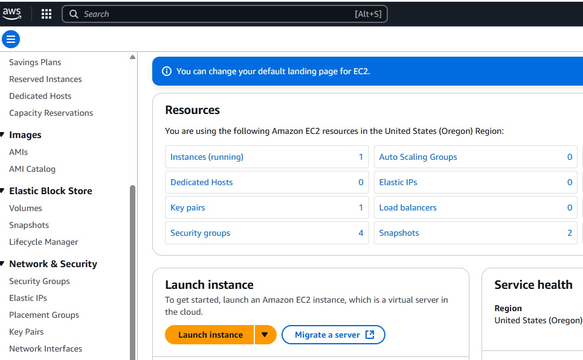
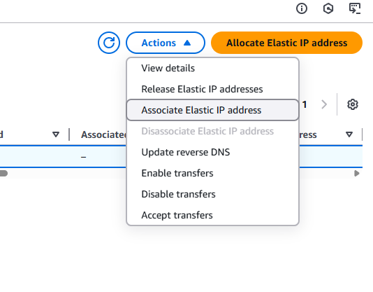

# EC2 - Elastic Cloud Compute

## Architecture

- EC2 Instances are Virtual Machines that run on **EC2 Hosts** - physical hardware machines that AWS manages.
  - Shared Hosts: shared across different AWS customers (NOTE: every customer is isolated from each other)
    - Default kind of EC2 Hosts
  - Dedicated Hosts: One customer pays for the entire host - not shared.
- **Availabilty Zone Resilient** - hosts run inside AZs. If the AZ fails, the Host and instances fail.
  - key: EC2 instances run in one Availability Zone
  - **Very AZ reliant** - everything about a EC2 instance - the host, the networking, the storage is all in the same AZ. \*All resources along with the EC2 instance MUST BE IN THE SAME AZ!
  - For resiliency across AZs, you deploy resources in multiple AZs and use a load balancer to distribute traffic across them all

### Resources for an EC2 Instance

- CPU
- Memory
- Instance Store - storage that is on a specific host. NOTE: If the instance moves off of that host, then the storage is lost.
- Networking:
  - Storage Networking
  - Data Networking
  - When an instance is provisioned into a subnet in a VPC, what happens is a primary Elastic Network Interface is provisioned in the subnet which maps to the actual hardware on the EC2 Host
  - Note: Instances can have multiple network interfaces in different subnets as long as they're in the same availability zone.
- Can connect to remote storage (EBS - Elastic Block Store). EBS runs in one Availability Zone (cannot access multiple EBS across zones)
  - You can allocate EBS Volumes (amount/area of persistent storage) to an EC2 instance in the same AZ.
- Generally instances of the same type (but could be different sizes) share the same host.
  - Hosts are associated with a date, with a certain CPU type and certain generation of hardware
  - It's logical that different types of EC2 instances that use particular features or generations of features will be grouped on the same host.

### Restarting/Stopping Instances

- Restarting EC2 Instances stay on the same EC2 Host machine unless:
  - The host fails or is taken down for maintenace by AWS
  - an instance is STOPPED and then STARTED (not re-started), then it will be relocated to a different host (in the same AZ!!)

### Use Cases for EC2

- Certain vendor requirements for support, need specific OS with specific environment and setup with a traditional application
- **Long-Running Compute capabilities**: Many other services have run time limits for compute, EC2 does not can be dedicated for long running processes and compute requirements.
- Traditional Server Style applications - i.e. a server listening for and handling requests
- Burst loads or steady state loads needed for an application requiring an operating system.
- Good for monolithic applications - Database, middleware components that need to be running on a traditional operating system
- Migrate Application workloads or provisioning a Disaster Recovery Environment
- Generally, EC2 is the default choice for compute requirements - traditional apps, etc.

## Instance types:

[Video](https://learn.cantrill.io/courses/1101194/lectures/27806425)
<br>
[AWS Docs - Instance Types](https://aws.amazon.com/ec2/instance-types/)
<br>
[Most Used Types PNG](./instancetypes.png)
<br>
[Filterable lookup of instance types overview/costs](https://instances.vantage.sh/)

- Different types allocate an amount of CPU, Memory, Local Storage Capacity and Storage type
- Types also change the ratio of those resources (i.e. more CPU vs. memory for compute optimized types)
- Influences the Storage and Network Bandwidth you get (if you use EBS volumes for example you need to make sure you have a type that allows good enough bandwidth over the network)
- System Architecture (ARM, x86) and Vendor(Intel, AMD)

### Five Main Categories of Types

- General Purpose: default workloads, equal resource ratio (use this unless specific reason)
- Compute Optimized: media processing, HPC, Scientific Modelling, gaming, Machine Learning
- Memory Optimized: large in memory datasets used, database workloads
- Accelerated Computing - Hardware GPU, field programmable gate arrays (FPGAs)
- Storage Optimized: high transfer rates or large amounts of I/O operations - high sequential and random IO is best use case

### Type Name Convention for Instance Types

- `R5dn.8xlarge`
  - `R`: Letter at start is instance family - designates type of computing/type of instance
  - `5`: The Generation number - these change as generations are updated (hardware updates, etc.) - always select the most recent generation (unless it is not in your region)
  - `dn`: Additional capabilities - series of letters that denote features available
    - `a`: signifies AMD CPUs
    - `d`: NVME storage
    - `n`: Network Optimized
    - `e`: Extra capacity of RAM or storage, etc.
  - `8xlarge`: Instance size - there are multiple sizes available for a family/generation (indicates how much memory and CPU the instance is allocated)
    - Note: usually better to scale up with larger number of smaller instance sizes due to price

### Most used types

- See [overview](./instancetypes.png)

#### General Purpose (T, A, M types):

- `A1`, `M6g`: ARM based processors are efficient and you can use smaller instances with lower cost and good performance
- `T3`, `T3a`: Burstable instances - normally low levels of CPUs but occasionally need to handle spikes of high CPU (and then return to the low level). A lot cheaper than other types of General Purpose instances
- `M5`, `M5a`, `M5n`: Steady State compute needs - i.e. load stays steady at 60% like for an email server. No bursts needed

#### Compute Optimized (C Type):

- `C5`,`C5n`: Good for general Machine Learning, gaming, scientific modelling

#### Memory Optimized (R type - i.e. Ram):

- `R5`,`R5a`: real-time memory apps, analytics, caches, some db applications
- `X1`,`X1e`: large scale in-memory apps with lowest cost per GB of memory in AWS
- High Memory series, `u-Xtb1`: Highest memory available in AWS

#### Accelerated Computing:

- `z1d`: large memory/CPU with directly connected NVMe storage
- `P3`: Good for parallel processing and machine learning (has GPU)
- `G4`: Good for graphics intensive requirements
- `F1`: FPGA to program hardware for tasks: finance analysis, big data, genomics
- `Inf1`: Machine Learning optimized for voice recongnition, forecasting, recommendation, analysis

#### Storage Optimized:

- `I3/I3en`: High performance SSD (NVMe), analytics, warehousing, NoSQL Databases
- `D2`: Dense Storage - data warehousing, HADOOP, Distributed File Systems, lowest price disk throughput
- `H1`: High throughput, Big Data, Apache Kafka

- As generation number increases, hardware improves
- _Compute Optimized_ are for high compute intensive tasks
  - Have the `c` instance class name
  - machine learning
  - game servers
  - batch processes, high workloads
- _Memory Optimized_
  - `r` series
  - Large data sets in RAM
  - Databases
  - web scale cache stores
  - large unstructured data
- \*Storage Optimized
  - `i` `d` `h1` series
  - Relational nosql databases
  - Redis
  - Cache in memory
  - Data warehouses

## SSH into EC2

### Recommended: Use SSM Manager Session Manager:

- [Installation and Verification Instructions](https://docs.aws.amazon.com/systems-manager/latest/userguide/session-manager-working-with-install-plugin.html)
- Follow instructions to install (with .exe for windows)
- Make sure aws cli is installed locally and configured with the account credentials and region
- Open powershell in administrator mode and run: `aws ssm start-session --target instance-id`

### Use script to connect by tag name for dynamic connection if Instance ID changes:

```shell
function ssm-connect-by-name() {
  local instance_name="YourInstanceNameTag" # Replace with your EC2 instance's Name tag
  local aws_region="YourAwsRegion" # Replace with your AWS region

  local instance_id=$(aws ec2 describe-instances \
    --filters "Name=tag:Name,Values=${instance_name}" "Name=instance-state-name,Values=running" \
    --query "Reservations[].Instances[].InstanceId" \
    --output text \
    --region "${aws_region}"
  )

  if [ -z "$instance_id" ]; then
    echo "Error: Instance with Name tag '${instance_name}' not found or not running."
    return 1
  fi

  aws ssm start-session --target "$instance_id" --region "${aws_region}"
}
```

### More notes on ssh

- [Video](https://learn.cantrill.io/courses/1101194/lectures/27806428)
- **BAD PRACTICE TO ALLOW ALL IP ADDRESSES IN SECURITY GROUP INBOUND RULES**
  - Use the IP (ip_prefix) value from here for AWS services if needed (i.e. to allow EC2 instance connect): https://ip-ranges.amazonaws.com/ip-ranges.json
- Make sure the security group for the EC2 instance allows your IP address in the inbound rules
  - You can go to Edit inbound rules in the security group > in the Source column dropdown select My IP
- Create a key pair - EC2 > Create Key Pair on left menu > .pem key
  - Download the key to your machine
  - Go to the folder you downloaded the .pem key, chmod to 400 permissions and use the command given in SSH Connect page in AWS console to connect
  - Using this method requires admin and does not scale as every team member needs a copy of this .pem file
- Using EC2 Instance Connect
  - You need to know the user name if using a custom AMI, otherwise it is guessed automatically for connecting
  - More scalable with high number of team members than using the .pem key

<br>
<br>
<br>
<br>
<br>

# From Cloud Practicioner Notes (Old):

- IaaS - Infrastructure as a Service
- Bootstrapping: running commands when a machine starts and boots up
  - Script is run ONCE on machine start
  - Bootstrapping script commands run with root user priveledges
  - EC2 setup - advanced options -> **EC2 User Data** script. Runs on startup of EC2 instance
- By default it is a private service (deployed into a subnet in a VPC in the private zone).
  - If you want to allow public access you need to configure that.
- IaaS - Infrastructure as a Service
- EC2 is AZ Resilient: If an AZ that the EC2 instance is in fails, then the instance will be taken down with it.

### Starting and Stopping an instance

- If stopping and restarting a EC2 instance, the public IP Address can change

# Security

## SECURITY GROUPS

- Security groups determine what is allowed into an EC2 instance
- Security Group acts as firewall at the instance level
- In contrast, Access Control List acts as a firewall at the subnet level
- **Locked to region/VPC and on instances**
  - You need to create a new security group for different regions or VPCs
- Not running on the EC2 instance - they exist outside of the instance
- Governs inbound and outbound traffic
- A firewall on the instance
  - regulate access to ports and IP ranges
- Can reference other security groups
- Best practice: maintain separate security group for SSH access

## Troubleshooting

- If you get a timeout and request hangs it means the security group might have a problem with the rules
  - This means that you probably are missing an inbound rule to allow traffic to your instance
- If you get "Connection Refused" then the security group is probably working and request went through, but application had an error or wasn't launched

# COMMON PORTS

- 22: SSH for Linux instance or SFTP - file upload with SSH
- 21: FTP File transfer
- 443: HTTPS
- 80: Unsecured web
- 3389: RDP (Remote Desktop Protocol) - used to ssh into Windows instance

## SSH into EC2

- ssh -i [keyfile.pem] ec2-user@[publicIP]
- Default user for EC2 instance and Amazon provided AMIs is ec2-user.
  - Check AMI usage instructions if default user is different
- Can also use EC2 Instance Connect in AWS Console.
  - \*\*DO NOT enter your credentials while shelled into instance with `aws configure`
    - anyone else in the account can get those credentials when they shell into it
  - You need to attach a IAM role to the instance to provide credentials and permissions to the EC2 instance in Instance connect
    - In instance page, Actions dropdown -> Security -> Modify IAM Role

## EC2 States

- Running - charged for storage, CPU compute, memory and networking
- Stopped - NOTE: Storage charges are still generated when an instance is stopped!
- Terminated: stops all charges and caution: deletes any storage for it. cannot undo.

## Spend Models

- On Demand
  - useful for unpredictable usage
  - most expensive but no upfront cost
- Reserved
  - 1 and 3 years
  - Discount from on demand, option to pay up front for discount further
  - useful for steady state apps -i.e. a database
  - Convertible reserved allows you to change types and specs with a little less discount
- Savings plans
  - 1 and 3 years, discount based on reservation for usage rate
  - Tied to region
  - allow for predicted use ($10/mo) and anything over is billed at on demand rate
  - Flexible on instance size, OS and Tenancy
- Spot Instances
  - Cheapest option, up to 90% discount from on demand
  - choose a spot price and if it goes over, then you lose the instance
  - less reliable and cheap, useful for resiliant workloads
    - batch jobs, image processing, data analysis, distributed workloads, flexible start and end time jobs
    - **NOT suitable for critical jobs or databases**
- Dedicated Hosts: book an entire physical server
  - Most expensive option
  - useful for compliance regulation requirements, software that has BYOL license requirements
- Dedicated (EC2) Instances: No other customers will share your hardware
  - hardware dedicated to you, but hardware is shared between instances in your account
  - no control over instance placement
  - This means that no other AWS Account will run an instance on the same Host, but other instances (both dedicated and non-dedicated) from the same AWS Account might run on the same Host.
  - Billing is per instance, with a cost of approximately 10% more than the normal instance charge (but no extra charge if it is the largest instance in the family since it requires the whole host anyway).
- Capacity Reservations:
  - reserve capacity in any AZ for a duration.
  - No discounts, need to combine it with another plan to get discounts
  - Charged whether you use it or not (whether you launch instances or not)
  - useful for short term predictable workloads in a specific Availability Zone.

## Shared Resonsibility

- AWS
  - Infrastructure
  - Isolation on phyusical hosts
  - faulty hardware
  - compliance validation
- YOU

  - Applications and internal security
  - Security Groups and correct IAM policies
  - Security of data

  # can use Route53 geolocation routing policy to to block certain geographies.

## Creating an EC2 Instance

### Generate a key pair if needed (for access)

- AWS Console > `EC2` > `Network & Security` on the left > `Key Pairs` > click Create Pair
  - Download the private part of the key pair (only one chance to do this)
- Give pair any name and choose RSA or ED25519 type
- Choose `.pem` (good for modern windows and mac os/linux)
  - ppk is used for older windows or use with Putty
- click Create Key Pair
- You download the private part of the pair and the public pair is stored on the EC2 instance itself.

### Create an instance

- EC2 Dashboard > Launch Instances
- Name the instance: ex: `MyFirstEC2Instance`
- Select the AMI and instance type etc.
- Pick and select the Key Pair that you created for the instance
- You can assign the EC2 to the default or custom VPC and select a subnet if you want as well (Note: this is tied to an AZ).
- Select whether you want to Enable auto assign a public IP (for internet outside access allowed etc.)
- Select to create a security group if needed and name it: i.e. `MyFirstInstanceSG` and put the same for the description
- Storage: selected by default according to the AMI
- When done, click Launch Instance
  - starts in pending state and takes a few minutes to get up and running
  - NOTE: Make sure the status checks have finished (Status Check column) which means the instance is fully ready
    - Should say something like 2/2 and not `Initializing...`

### Connecting to an EC2 Instance

- [video](https://learn.cantrill.io/courses/1101194/lectures/39551633)
- AWS Console > EC2 > Select running instances and the instance > Right click on the instance and click `Connect`
- Select the `SSH Client` tab which gives you info on how to connect
- Use the ssh client on your machine
  - Navigate to the folder location where your .pem keypair is located on your machine
  - Change permissions on the keypair file if you get permission denied (usually on mac or linux) - copy the `chmod` command the SSH Client tab in AWS console tells you to use
    - If using windows need to [use different process](https://docs.aws.amazon.com/AWSEC2/latest/UserGuide/connect-to-linux-instance.html#connection-prereqs-private-key)
  - Copy the command in the ssh client tab from the aws console to connect to the EC2 instance via ssh.

### Cleaning up or removing an Instance

- Right click on the instance in the dashboard and click terminate
- Clean up the security Group (in the left menu panel) - select it and click on `Actions` dropdown and select delete security groups.
  - May have to wait until EC2 instance is terminated before this is allowed.

# Network Interfaces

### ENI Elastic Network Interfaces

- EC2 instances always start with at least one ENI - the Primary Network Interface
- Network Interfaces must be in the same AZ (can connect secondary Network Interfaces on different subnets)
- Components such as IP addresses, Security Groups and more look like they're attached to the EC2 instance, but they are actually attached to the Network Interface
  - MAC Address: the hardware address of the interface. Visible to the OS and can be used for things like software licensing
  - Primary IPv4 private address: each network interface has this and it is in the range of the subnet that the interface is created in
    - When selecting a VPC and subnet for an EC2 instance you are actually picking those for the primary network interface
  - 0 or more secondary IP addresses
  - 0 or 1 Public IP address for the interface
  - 1 or more Elastic IP address (1 per private IPv4 address)
    - different from public address where you can only have one
  - 0 or more Ipv6 addresses (all of these are publicly routable, there is no concept of private/public with ipv6)
  - Security Groups can be attached to Network Interface and affects all IP addresses on that interface
  - Source/Destination checks can be enabled/disabled.
    - If enabled, traffic on the interface is discarded if it's not from one of the ip addresses as a source or going to one of the IP addresses on the interface marked as a destination
    - You would disable this if you need the network interface to function as a NAT gateway instance, for example
- Different instance types allow you a different number of secondary network interfaces
  - With secondary interfaces, you can detach them and move them to other EC2 instances (unlike primary interfaces~)

### IP Addresses and DNS

- EC2 Instances (via the Primary Network Interface) are given a primary private IPv4 IP Address and a DNS name associated with it.
  - These never change throughout the instances lifetime
  - Only resolvable insided the same VPC
- Private primary IPv4 address naming convention: `10.16.0.0` translates to `ip-10-16-0-0.ec2.internal`
  - ip-{ipaddr-separated-by-dashes}.ec2.internal
  - can use the private DNS name to get the internal private ip address of an instance in the same VPC
- If configuration is set to assign a public IP address, the primary network interface/ec2 instance will get one
  - This public IP is dynamic and NOT fixed
  - Stopping and Starting an instance will change the public IP address! and so will anything causing an instance to move to another EC2 host
  - stopping de-allocates the address and starting again gets a new address to be allocated for it
  - Restarting/rebooting an instance will not change the public address
- Public Addresses have a DNS name generally in this format: ip `3.87.9.136` translates to `ec2-3-87-9-136.compute-1.amazonaws.com`
  - Inside the VPC: Public DNS name translates to the internal PRIVATE IPv4 address! (remains more stable using the private address instead of the public one)
  - when referenced inside the VPC traffic never leaves the VPC (i.e. it does not go out to the internet gateway and back in)
  - Outside of the VPC: The public DNS always resolves to the public IP address, not the internal one
  - Public addresses are not attached to the network interface/instance - they are associated and handled by the Internet Gateway which handles translation
- The OS of an instance cannot ever see the public IPv4 address. That is handled by NAT via the internet gateway.
  - The OS always deals with the private IP address on the Network Interface
  - You will never configure a public IPv4 address in the OS (windows/linux etc.)

### Elastic IP Addresses

- To avoid dynamically changing public IP addresses when instances are stopped/started, you need to allocate and assign an Elastic IP Address that remains stable
- You allocate Elastic IP Addresses to your account and use them with a primary or secondary network interface
- If you associate an elastic IP with a primary network interface on an instance, the current Public IPv4 address for that instance is removed and replaced with the Elastic IP address in its place
  - If you remove the Elastic IP Address, the instance will gain a new public IPv4 address (there is no way to get the first public IP address back)

### Setting up Elastic IP address for an EC2 instance

- Go to EC2 > Network and Security (left side menu) > Elastic IPs
  <br>
  
  <br>
  <br>

- Click Allocate Elastic IP address > Allocate.
- Select the new EIP, click Actions > Associate Elastic IP address.
  <br>
  
  <br>
  <br>

- Choose your EC2 instance and associate.
  - typically don't need to specify a private IP address unless your instance has multiple network interfaces or private IPs. Can leave blank.
  - If the EIP is already in use (e.g., associated with another instance), checking "Allow this Elastic IP address to be reassociated" will disassociate it from the current resource and associate it with the new instance you're selecting. If unchecked and the EIP is already associated, the association will fail with an error.
- Update your Route53 A record(s) to point to the EIP (only needed once).
- **Cost: EIPs are free when associated with a running instance.** If the EIP **is unassociated**, AWS **charges a small fee** (~$0.005/hour, ~$3.60/month).
- If your EC2 instance is terminated (not just stopped), the EIP will become unassociated, but you can associate it with a new instance

### Use cases for Network Interfaces

- Licensing via a MAC address can be moved to different hosts/instances via just moving the interface that has that MAC address
- Can have separate network interfaces for management and data
- Multiple Interfaces can be used with different Security Groups on each (Security Groups are attached to the network interfaces, not the instance itself)
  - Useful if you need different rules for different IP addresses your instance has, for example.

### Manual installation of software on EC2

- [Demo](https://learn.cantrill.io/courses/1101194/lectures/27806465) at timestamp 7:14
- [Commands](https://learn-cantrill-labs.s3.amazonaws.com/awscoursedemos/0006-aws-associate-ec2-wordpress-on-ec2/lesson_commands_AL2023.txt)
- Enabling and starting services for rebooting restarts, etc.

## Purchase Options (EC2 types)

### On Demand

- Default option - start with this and only move to something else if needed, mostly okay for normal usage 99% of the time - no capacity management needed.
- Ideal for short term workloads or undetermined workloads - something you need to provision for something and then terminate or not sure of need
  - short term workload which needs the cheapest EC2 pricing but **can't tolerate interruption**
- Different customers using isolated instances can exist on the same host and use shared hardware
- Reasonable cost - per second billing while instances are running
  - When shutting an instance down you're not paying for the resources
  - Associated resources like storage still charge regardles if the instance is shut down
  - No discounts, consistent pricing.
- If there is a capacity or system failures, reserved types are receieve priority provisioning over On Demand options
  - If the business need is critical then you should consider using something other than On Demand

### Spot Purchase Option

- Per region, there is free unused capacity on EC2 Hosts - AWS takes this and offers it at a spot price which is cheap
- You set a maximum price you are willing to pay and AWS will have their own price. If their price is lower than your maximum price, you will pay only their current spot price per second.
- **If capacity needs change, AWS can raise the spot price at will** - if the raised spot price exceeds the maximum price you set to pay, your instances will be automatically terminated.
  - These instances should not be viewed as reliable
- Should not be used for workloads that cannot tolerate interruptions or are needed long term
- Good use cases are for things that are not time critical or need reliable uptime.
  - Good for broken up tasks or stateless workloads that can be re-run on failure

### Standard Reserved Instances

- For known Long term consistent usage and core parts of your system and workloads that cannot tolerate interruption
- Unused reservations are still billed!
- Locked to an AZ or region and specific instance type
  - If locked to an AZ, then reservations only apply to instances launched in that AZ
  - If you have a reservation for a smaller instance type than you provision you will get a partial cost effect
- Should be used for parts of infrastructure that are always there and never change
- Time commitment must be 1 or 3 years for a reduced per second fee.
  - All Upfront: You can optionally pay for the entire agreed term for the greatest discount - longer term means cheaper but you are locked in, but there is no per second fee this way.
  - Partial Upfront: reduced pay per second fee - good middle ground without long commitment
  - You pay whether the reservation is used or not
- Note: reserved instances are still on hosts that are shared with other customers, like On Demand

### Scheduled Reserved Instances

- Long term requrements, but it doesn't need to run consisently and constantly (i.e. only at specific times of day or specific days in a week)
- Specify the frequency, duration and time of use (i.e. daily for 5 hours)
- Get a slightly cheaper rate than On Demand, but you can only use it for that specified time
- Use cases: Sales analysis data that needs to run at steady intervals (once a day or week, etc.) for the foreseeable future
- Minimum commitment is one year

### Capacity Reservations

- USed for critical operations that cannot tolerate interruptions (AWS will allocate capacity to reserved tiers over On Demand, etc. if there is a failure)
- Billing component
- Capacity Component: can reserve capacity but no need for long term commitment to AWS
- Types of reservations - need to commit at least one year for these:
  - Regional Reservation crosses AZs - billing discounts for any instances launched into a region.
    - Note: no capacity reservation with this alone. You are at the same priority as On Demand instances in the case of a widespread failure or issue with AWS
  - Zonal Reservations: this is for a specific AZ, but also reserves capacity for that AZ
- On Demand Capacity Reservations: for a specific AZ and you always pay for the capacity whether you consume it or not - you do get higher priority from on demand capacity if system failure across AWS
  - No time commitment required
  - Need to know what capacity you require so you don't waste it if it is not used.
  - No cost reduction. If you don't need all the capacity and are doing something that is consistent, it might be cheaper to use Reserved Instances instead

### Dedicated Host

- A host allocated to one customer entirely (no shared hardware with other customers)
- The hosts are designed for a specific family - A, C or R for example
- INstances on the host have no per second charge - you pay for the entire Host
- You need to manage the host's capacity - if you run out then you cannot launch anymore instances.
  - Limited number of instances you can launch on your host
- Host Affinity: feature linking EC2 instances to certain EC2 Hosts. Stopping and starting the instance will remain on the same host.
- **Reason to use option is for socket and core licensing requirements** (for software that is bound and tied to specific hardware via a license agreement)

### Dedicated Instances

- Launch instances on a host and AWS commits to not letting any other customers using hardware on that same host - only your instances can be launched on it.
- Useful when you don't want to share hardware, but you don't want to manage the host itself.
- Pay a cost premium to ensure you will never share underlying hardware with other customers
- You do not pay for or own the host itself
- Billing: hourly fee for any regions you're using dedicated instances, regardless how many you are using in that region.

### Savings Plan

- Time based commitment on a hourly cost you will pay consistently for that time commitment (i.e. 20 dollars an hour for 3 years)
- You get a reduced cost on resources with this comittment
- Useful if migrating away from EC2 to other services like Fargate, Lambda and serverless architectures
- two types
  - General Compute amounts - can save up to 66% on the normal on demand price
    - Valid for various compute services: EC2, Fargate and Lambda
    - Savings plan rate expires after you've consumed the price usage commitment you made, afterwards you get charged normal on demand rates. You should evaluate your usage and adjust the savings commitment as needed.
  - EC2 Savings Plan - you have to use only EC2, but get up to 72% reduction in price from regular on demand charges.

## Status Checks & Auto Recovery

### Instance Status Checks

- Every EC2 instance has 2 high level status checks
  - EC2 console should show 2/2 checks passed, otherwise there is a problem
- First check: System Status
  - indicates EC2 service or host issues: loss of system power, loss of network connectivity, or software/hardware issues with the EC2 host
- Second check: Instance Status
  - Corrupt file system, networking problems (internal, bad settings set), OS kernel issues preventing correct boot up

### Auto Recovery

[Video](https://learn.cantrill.io/courses/1101194/lectures/27806478) timestamp 3:01

- Simple feature to automatically handle recover if the status checks fail or ec2/host specific problems
- Moves instance to a new host, starts it up with the same config as before (IP addressing is maintained), restarts any software configure to auto-restart
- Enables potential full recovery from any status checks issues.
- Go to EC2 instance in AWS console > Status Checks tab for instance > Actions dropdown > Create Status Check Alarm
  - Will alarm if instance fails checks
  - SNS notification sent by default if checks fail a set number of times within a selected time period
  - Alarm Action can be set to specify what to do when the alarm occurs - recover, restart, stop or terminate the instance
  - To use Auto Recovery, select the Recover option in the Alarm Action options

#### Auto Recovery considerations

- Note: does not protect against AZ wide failure - only takes action inside the AZ that the instance is provisioned in and EC2 instance host/specific instance problems.
- Requires available extra capacity - in case of major failure across AZs in a region this won't work if the entire region is down etc.
- Only works with certain instance types, see [docs](https://docs.aws.amazon.com/AWSEC2/latest/UserGuide/ec2-instance-recover.html)
- Does NOT work if using instance store volumes - only works with instances that have EBS volumes attached.

### Termination Protection

[Video Demo](https://learn.cantrill.io/courses/1101194/lectures/27806479)

- Adds a layer of protection to prevent inexperienced team members from terminating an instance on accident
  - an ec2 attribute is set `disableApiTermination`
- Adds an extra permission which is required in order to terminate an instance (you need permissions to disable the protection to be able to first turn it off and then terminate an instance)
  - Allows for role separation where you can give permissions to enable/disable the protection to one group of people (i.e. only Senior Administrators) and the ability to actually terminate to another group (i.e. normal or junior Administrators)
- In AWS Console go to EC2 > right click on instance > Instance Settings > Change termination protection option. Click enable and save in the dialog that comes up.
- If you try to terminate an instance with this on, you will be presented with an error that it could not be terminated when you click on Terminate.

#### Change shutdown behavior

- Note: you can also right click on EC2 instance in console > Instance settings > Change shutdown behavior to tell AWS to terminate or stop instances.
  - the default is to stop the instance, not terminate it
  - If you don't want a bunch of stopped instances lying around for example this can be changed to just terminate on failure or shutdown.

## Instance Metadata

- Service provided to instances with data about the instance that can be used to configure an instance.
  - Accessible via an endpoint with the metadata IP address http://169.254.169.254/
- Allows the instance to access information about its environment that it wouldn't be able to access otherwise
- Accessible in all instances at IP address `169.254.169.254`
  - endpoint: `http://169.254.169.254/latest/meta-data/{attribute}`
- Environment info access: host name, events, security groups, etc.
- Allows access to Networking info (OS of an instance cannot see any of its own IPv4 public addressing, this allows the instance to see it)
  - OS only has exposure to private IPv4 addresses
  - A public IPv4 address is never configured in an instance Operating System, it is only configured by the Internet Gateway resource
  - Note: IPv6 is configured in the OS, since it is always public (no concept of private/public with IPv6)
- Authentication information access
- Used to pass in temporary ssh keys by AWS (using instance connect, for ex. behind the scenes it does this)
- User-data access. can run scripts for automation steps on the instance
- **Meta-data service has no authentication or encryption**
  - anyone who can access the instance can see the meta-data
  - assume that meta-data is exposed and treat it as public data

### Metadata commands:

- Can access the metadata endpoint with curl on the instance
- Can also download the AWS query tool

```shell
# example queries for some attributes of the instance:
curl http://169.254.169.254/latest/meta-data/public-ipv4
curl http://169.254.169.254/latest/meta-data/public-hostname # public DNS name

# Download the AWS query tool for easier use
wget http://s3.amazonaws.com/ec2metadata/ec2-metadata
chmod u+x ec2-metadata # on linux make whereever it downloaded the tool to executable

# commands with query tool
ec2-metadata --help # get list of commands
ec2-metadata -a # show AMI used to launch this instance
ec2-metadata -z # get availability zone the instance is in
ec2-metadata -s # show any security groups launched with the instance
```

# Bootstrapping EC2 Instances (User data)

- Starting an EC2 with scripts when an instance is first launched (not necessarily every time it stops/starts - you need to enable that explicitly somehow)
- "Bootstrapping": A system self-configures or performs some self-configuration steps
- EC2 Bootstrapping allows for build automation (steps that occur to bring the instance into a configured state)
  - Different from relying on an AMI in a configured state - a way to automate initial configuration tasks without requiring you to bake everything into an image beforehand (gives you a lightweight, flexible way to set up an instance on-the-fly without modifying the base AMI)
  - AMI Baking (custom AMIs) are less flexible than user data bootstrapping
  - Optimal configuration is to combine AMI Baking and Bootstrapping
- Allows you to do something when the EC2 instance is launched (install software, post software install configuration)

### EC2 User data

- Bootstrapping is enabled using user data
  - Injected into the instance in the same way that meta-data is
- **Accessed via the meta-data IP** (`http://169.254.169.254/latest/user-data`)
- User data is data you can pass into an EC2 instance
  - The user data passed in is run as a script by the instance's operating system
  - Anything in User Data is executed by the instance
- **EXECUTED ONLY ONCE AT INSTANCE LAUNCH TIME**
  - If you change/update user data and restart the instance, it is NOT executed again! It only executed on the initial launch of the instance
  - User data can be modified (if you shut down/stop the instance, change the user data, and start the instance up again, the new data is available inside the instance's user data). Again, it is only EXECUTED ONCE on launch and not again. This is not very useful outside of post-launch configuration and not the best way to pass data in afterwards.
- Limited to 16KB in size
  - Anything more complex, you need to pass in a script which will download that larger data

### Checking User Data Error logs

- logs are in /var/cloud-init-output.log and /var/log/cloud-init.log
- `cat /var/log/cloud-init-output.log | grep user`
- Logs are also at `cat /var/log/cloud-init.log`
- Check the user data loaded at `curl http://169.254.169.254/latest/user-data`

### User Data considerations/risks

- EC2 does not interpret or check the data, it simply passes it into the instance as is (no validation, etc.)
  - The user data is passed as a block of data into the instance - it runs successfully or it still runs, but not successfully - EC2 doesn't know or care if this happens - the user data is completely opaque to EC2
  - The instance will still be a in a RUNNING state after launch even if the user data had a problem - you will then have a bad configuration
- A process will just run the user data passed in as the root user on that instance
  - Software comes with an EC2 instance which is designed to look at the metadata IP (`http://169.254.169.254/latest/user-data`) for any user data present and execute it on instance launch
- **User Data is NOT SECURE** - anyone who can access the instance can access the user data
  - DO NOT use it for passing in long term credentials - this is bad practice
  - Should use Parameter Store/Secrets Manager instead for credentials etc.

### Boot-Time-To-Service-Time

- The goal in launching instances is to reduce the Boot time to service to be as low as possible.
- AMI Baking (pre-configuration): time to service from boot is measured in minutes
- Post-launch is additional configuration needed after the Instance is launched to make it ready for service
  - Bootstrapping is a way to reduce the post-launch time to service from potentially hours to minutes
- Optimal way to configure launching instances is to combine user data and AMI Baking
  - Use AMI Baking for the configuration which is time intenstive and takes longer
  - i.e. application installation that takes the most time to install and only a short time to configure
    - AMI Bake in the installation of the software
    - Bootstrap the (less time intensive) final configuration of the software
    - This reduces the Boot-Time-To-Service-Time but also allows for some flexibility and configurability

### Bootstrapping with user data in AWS console

[Video Demo](https://learn.cantrill.io/courses/1101194/lectures/27895409)

- timestamp 7:20 shows entering user data on launching an EC2 instance
- NOTE: EC2 accepts Base64 Encoded Data (not just plaintext)
  - The UI in AWS console does the conversion for you automatically (so you can paste in plaintext script and it will convert it to base64 automatically)
  - if you are already passing in base64 encoded data, check the "User data has already been base64 encoded" checkbox
- Note that after you launch the instance with the user data script, it will show as RUNNING, but you may need to wait a little while longer while the user data script is run for it to be ready for service (there may not be any indication of this in AWS console, you just need to wait a while)
  - You could check by ssh'ing into the instance and seeing if some kind of custom message that was setup in the user data script (i.e. with cowsay for instance) is showing - then you know the user data config completed.

#### With CloudFormation:

- [Video Demo of CloudFormation setup](https://learn.cantrill.io/courses/1101194/lectures/29447330) at timestamp 0:56 shows adding User Data to a CloudFormation Template

```yaml
Description: MyApp
Parameters: #...
Resources: #...
  PublicEC2:
    Type: AWS::EC2::Instance
    Properties:
      InstanceType: "t2.micro"
      ImageId: !Ref LatestAmiId
      IamInstanceProfile: !Ref SessionManagerInstanceProfile
      SubnetId: !Ref SubnetWEBA
      SecurityGroupIds:
        - !Ref InstanceSecurityGroup
      Tags:
        - Key: Name
          Value: A4L-PublicEC2
      UserData: # USER DATA definition
        Fn::Base64:
          !Sub | # use the fn because user data needs to be provided in base64 encoded format
          #!/bin/bash -xe
          ...rest of user data script in plaintext

# ...
```

#### Example user data script

```shell
#!/bin/bash -xe

# (you'd install software using AMI Baking and then do some final configuration here)
# Web and DB Servers Online - and set to auto start
systemctl enable httpd
systemctl enable mariadb
systemctl start httpd
systemctl start mariadb

# set permissions for software installed
usermod -a -G apache ec2-user
chown -R ec2-user:apache /var/www
chmod 2775 /var/www
find /var/www -type d -exec chmod 2775 {} \;
find /var/www -type f -exec chmod 0664 {} \;

# configure some installed software, i.e. COWSAY
echo "#!/bin/sh" > /etc/update-motd.d/40-cow
echo 'cowsay "Amazon Linux 2023 AMI - Animals4Life"' >> /etc/update-motd.d/40-cow
chmod 755 /etc/update-motd.d/40-cow
```

#### Accessing the user data in the instance

- Can get a token to connect to the meta-data service (AMI Linux 2023 requirement)
  - TOKEN=`curl -X PUT "http://169.254.169.254/latest/api/token" -H "X-aws-ec2-metadata-token-ttl-seconds: 21600"`
- Get the user-data of the instance (it is a component of the meta-data service, so use the meta-data ip address and just append user-data instead of meta-data)
  - curl -H "X-aws-ec2-metadata-token: $TOKEN" -v http://169.254.169.254/latest/user-data/
  - This will print out the user-data script if present

### Troubleshooting Bootstrapping problems

- cd into `/var/log` on the instance
- two folders are useful for debugging user data bootstrapping errors and problems:

  - `/var/log/cloud-init-output.log`
    - Shows all of the commands executed on the EC2 instance and the output of those commands
  - `/var/log/cloud-init.log`
    - very verbose version of cloud-init-output.log. Used for deeper debugging and provides more information than cloud-init-output.log.

- Check userdata logs:

```sh
sudo cat /var/log/cloud-init-output.log | grep -i cloudwatch
sudo cat /var/log/cloud-init.log | grep -i cloudwatch

sudo cat /var/log/cloud-init-output.log | grep -i -E 'cloudwatch|s3|error'
```

## Installing Docker on an EC2 instance

- [Video Demo](https://learn.cantrill.io/courses/1101194/lectures/36184903)

```shell
# Install Docker Engine on EC2 Instance
sudo dnf install docker
sudo service docker start
sudo usermod -a -G docker ec2-user

LOGOUT and login

sudo su - ec2-user

# Build Docker Image
cd container
docker build -t mycontainer .
docker images --filter reference=mycontainer

# Run Container from Image
docker run -t -i -p 80:80 mycontainer

# Upload Container to Dockerhub (optional)
docker login --username=YOUR_USER
docker images
docker tag IMAGEID YOUR_USER/mycontainer
docker push YOUR_USER/mycontainer:latest
```

## EC2 Instance Role

- A specific type of an IAM Role
- An EC2 instance can assume a role and anything running within that instance has the permissions that role grants
- Roles have a permissions policy attached to them. The role assumer is given temporary credentials which allow them to have permissions which the attached policy/role grant
- EC2 instances assume an instance role automatically when they are linked/attached
- You can attach an InstanceProfile/Role to many different instances

### Instance Profile

- Intermediate piece of architecture that delivers the permissions inside to the instance
- A wrapper around an IAM role
- When an instance role is created in the AWS console, an InstanceProfile is also created with the same name
  - NOTE: if using the CLI or CloudFormation, the role and the InstanceProfile need to be created SEPERATELY
- **What is actually attached to the instance is the InstanceProfile** (the same name as the Role), not the Role.
- Temporary credentials are delivered via instance meta-data
  - An application in the instance can access these credentials and use them to access AWS resources (S3, etc.)
  - Credentials are ALWAYS VALID - they are automatically renewed by AWS EC2 before they expire - The application just needs to keep checking the meta-data for the latest credentials (careful about caching - always check before they expire or periodically)
  - In the meta-data on the instance there is a tree to access the credentials: `iam/security-credentials/{role-name}`
    - Ex: `http://169.254.169.254/latest/meta-data/iam/security-credentials/A4LInstanceRole`
- **Always use Roles rather than storing long-term credentials**
  - Do not store access keys, etc. in an EC2 instance
  - Don't use `aws configure` and provide access keys ever on an instance
- Any CLI command line tools running in the instance will automatically use the Instance Role credentials as long as the role/instanceprofile is attached to the instance

#### CLI Precedence rules

- When using the AWS cli command line tool, it checks in this order: https://docs.aws.amazon.com/cli/latest/userguide/cli-chap-configure.html#cli-configure-quickstart-precedence
  - Checks these sources/namespaces in order for the credentials until it finds them in one
  - Note that if you configure any credentials manually (`aws configure`), then those will override and be checked first before the instance role credentials

### Setting up an Instance Role

- [Video demo](https://learn.cantrill.io/courses/1101194/lectures/27895412) at timestamp 3:45
- AWS Console > IAM > Roles > Create Role > select AWS Service option - select EC2 use case
- Select permissions and next, then give a name like `A4LInstanceRole`
  - This creates a role and InstanceProfile (this is what is actually attached to the EC2 Instance)
  - NOTE: in the AWS Console UI you will not see 2 seperate things for the role and InstanceProfile (they are seen as the same thing)
- In EC2 > right-click instance in list > security > Modify IAM Role > select the role you created
  - Under the Security tab in the EC2 page, you'll see the IAM Role listed under "IAM Role" in the Security tab
- Now back in the instance (ssh in etc), if you run something like `aws s3 ls` you will get the list and not be warned about not having credentials
- The credentials are stored at
  - `curl  http://169.254.169.254/latest/meta-data/iam/security-credentials/` - first run this and then the next to see the credentials which are used
  - `curl http://169.254.169.254/latest/meta-data/iam/security-credentials/A4LInstanceRole`

# Internal EC2 and Application/System Logs

- Logging from within the OS on an EC2 instance
- Cloudwatch/Cloudwatch Logs cannot capture data/metrics happening inside an EC2 instance natively
- In order to get visibility to metrics inside EC2 instances, you need the Cloudwatch Agent
  - The CW Agent is software that runs inside the EC2 instance on the Operating System which captures OS visible data and sends it to into Cloudwatch or Cloudwatch Logs
  - The agent needs to have the configuration and permissions to send data into Cloudwatch products and servicesl

### Setting up and Configuring the Cloudwatch Agent

- Best practice is to create an IAM Role with permissions to interact with Cloudwatch Logs
- Attach this IAM Role to the instance which allows anything running on the instance to access the CloudWatch and CloudWatch Logs services
- Configure the Agent to define what metrics and logs you want to capture on the instance
  - These will be injected into CloudWatch using log groups
  - Configure one log group for every log file you want to capture
    - Within each log group there is a log stream which represents a particular instance performing logging
- CoudFormation can be used to include the agent configuration for every instance provisioned
- One way to store agent configuration is using the AWS Parameter Store
  - After configuration is created in parameter store (standard tier is free of charge), you can use Systems Manager or EC2 User-data to bootstrap it in to the instance for use with CloudWatch Agent

### Viewing Metrics

[Demo](https://learn.cantrill.io/courses/1101194/lectures/29448612)

- In AWS Console > CloudWatch > Metrics > select the "CWAgent" namespace widget
- Select the widgets, i.e. "InstanceId" to see Operating System level metrics you now have access to on ths instance
  - under InstanceId group metrics you can see disk percent used and others
  - You would not normally have access to these metrics on the instance if you didn't install the Cloudwatch Agent

### Manually installing the Cloudwatch Agent onto an Ec2 Instance

[Video](https://learn.cantrill.io/courses/1101194/lectures/27895417)

```shell
# Install the agent (this does not start or configure it):
sudo dnf install amazon-cloudwatch-agent


# CREATE THE IAM ROLE

# Attach a created IAM Role to the instance to access parameter store (for config) and Cloudwatch services
  # AWS IAM console > Roles > Create Role
  # Select AWS Service optoin and EC2 for the Use Case
# Add Managed Policy `CloudWatchAgentServerPolicy`
# And `AmazonSSMFullAccess`
# Call the role `CloudWatchRole`
# Go to EC2 console > right-click on instance > Security option > Modify IAM Role


############# CREATE THE AGENT CONFIGURATION #######################

# start the Cloudwatch Agent:
sudo /opt/aws/amazon-cloudwatch-agent/bin/amazon-cloudwatch-agent-config-wizard
# Accept all defaults, until default metrics .. pick advanced - this captures extra metrics that might be useful.

# then when asking for log files to monitor

# 1 /VAR/LOG/SECURE
/var/log/secure
/var/log/secure # prefer using the full path instead of default "secure" for any system logs
(Accept default instance ID)
Accept the default retention option

# 2 /var/log/httpd/access_log
/var/log/httpd/access_log
/var/log/httpd/access_log
(Accept default instance ID)
Accept the default retention option

# 3 /var/log/httpd/error_log
/var/log/httpd/error_log
/var/log/httpd/error_log
(Accept default instance ID)
Accept the default retention option

Answer no to any more logs
Save config into SSM
Use the default name.


######## STORE THE AGENT CONFIGURATION IN PARAMETER STORE #################

# Config will be stored in /opt/aws/amazon-cloudwatch-agent/bin/config.json and stored in SSM
# This configuration created once and stored in the Parameter Store and can be re-used for other EC2 instances at scale

# Standard Parameters do not incur any charges and are free

# The agent expects a piece of software collectd and a database file to be installed and exist:
# (these are needed else the agent won't start)
sudo mkdir -p /usr/share/collectd/
sudo touch /usr/share/collectd/types.db

################ START AGENT ############################

# Start the Cloudwatch Agent with the configuration stored in the Parameter Store:
sudo /opt/aws/amazon-cloudwatch-agent/bin/amazon-cloudwatch-agent-ctl -a fetch-config -m ec2 -c ssm:AmazonCloudWatch-linux -s
```

# Placement Groups

- A feature that allows you to influence where the EC2 Host is and the placement of the instance into a particular physical location (on the EC2 Host in that location)
  - Normally when you launch an instance, AWS decides where to place it and on which actual EC2 host based on the region/AZ
- Useful for placing instances physically close together

### Types of Placement Groups

- **Cluster Placement Groups**: Any instances in this group are physically close together
- **Spread Placement Groups**: Ensures instances are separated and using different underlying hardware (the inverse of the above) Cluster group.
- **Partition Placement Groups**: For distributed applications across a large area that have infrastructure awareness - groups of instances, but each group is on different hardware

### Cluster Placement Groups

- Used when you need the highest level of performance and lowest latency possible
  - Use cases include scientific analaysis workloads or High perf compute
- Best practice is to use the same type of instance in the groupa and launch all of the instances in the group at the same time
  - Helps ensure that AWS allocates capacity for everything you require
- Cluster groups must be launched into a single AZ
  - When launching AWS will lock the AZ to the one that is chosen automatically when the first instance in the group is launched
- Instances in a cluster group use the same physical rack, but often the same EC2 Host machine as well giving fast direct bandwith to all other instances in the same group.
  - Can acheive 10GB/second vs. the usual 5GB/second transfer rate
  - requires enhanced networking enabled on all instances and choosing a EC2 type with high network performance
- (Little to no resilience) The con of all of this is that if the hardware fails, it could take down all instances in the cluster.
  - Single AZ - cannot span different AZs
- Able to span VPC peers but impacts performance negatively
- Requires a supported instance type.

### Spread Placement Groups

- Ensures maximum amount of Availability and Resilience
- Can span across different AZs
  - Each instance is on a separate rack
  - Limit of 7 instances per AZ

#### Exam points

- Spread Placement Groups provide infrastructure isolation
  - Gauranteed that an instance launched into a spread placement group will be entirely separated (on another physical machine/rack with it's own power source) from every other instance in that placement group
- Dedicated instances or hosts are not supported with Spread Placement groups

#### Main use case for Spread Placement Groups:

- When you have a small number of critical instances that need to be kept physically separated from each other
  - mirror instances of a file server
  - different domain controllers within an organization
- Ensures there is high availability for that component (if one instance fails there is reduced chance the others will)
  - Maximizes the availability of an app

### Partition Placement Groups

- **Designed for Huge scale parallel processing systems to increase and provide resiliency in case of failures and replication**
  - need to create groupings of instances and have them separated
  - allows you to control which instances are in which partition so you can design your own resilient architecture
  - made for more complex apps to get same resilience as you get for spread placement groups and has awareness of own topology - DSFS, HBase and Cassandra
  - **Main difference**: With spread placement groups more is handled for you, but there is the 7 instance per AZ limit. with partition groups you have more control for more than that limit but your app needs to manage and administer partition placement overhead.
- Use case for when you have more than 7 instances per AZ (limit for Spread Placement Groups), but you still need physical separation and high availability
- Can be created across multiple Availability Zones in a region
- each partition has it's own rack (isolated power and networking resources)
  - no sharing of infrastructure between the partitions
- Unlike limit of 7 per AZ with spread placement groups, you can have as many instances as you want and specify the partition or have EC2 split them up automatically
  - If you launch all instances into one partition and it fails - you lose all instances
  - If you put one instance per partition then you get behavior similar to spread placement groups

## Enhanced Networking

- High performance for features such as EC2 Cluster placement groups or apps that need high performance networking speed
  - Ideal for transferring lots of small packets around a small isolated network
- Uses SR-IOV - Single Route I/O Virtualization. Makes it so the physical hardware (i.e. a network card) is aware of virtualization
- Without Enhanced Networking: multiple Ec2 instances use the single physical network card or device on the machine host to communicate
  - The single card is not aware of virtualization so the host has to sit in the middle controlling which instance has access to the physical network card at one time (via software)
    - This is slower and can use more CPU cycles, and when the host is under heavy load performance drops can occur, more latency and bandwidth fluctuation
  - With enhanced networking the physical card divides itself into logical cards so that the host does not have to juggle and manage which instances can access at a time
  - The physical card handles this management without consuming CPU and host resources
- Higher I/O across all instances on the host and lower CPU power requirements -- more bandwidth with faster networking speeds and CONSISTENT LOW LATENCY

- Available BY DEFAULT or no extra charge on most modern EC2 instance types!

### EBS Optimized Instances

- Option is set on a per instace basis - ON or OFF
  - Generally enabled by default and you don't have to set it
- Dedicated capacity from a EBS storage instanceis provided for a particular EC2 instance for EBS usage
  - Faster speeds using EBS
- Usually this is supported and enabled by default on most newer EC2 instances
