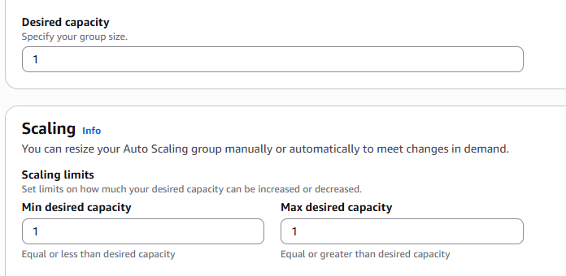
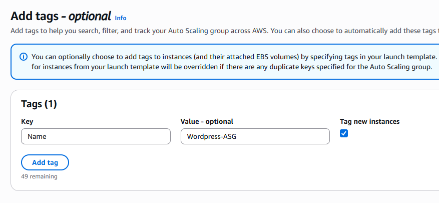
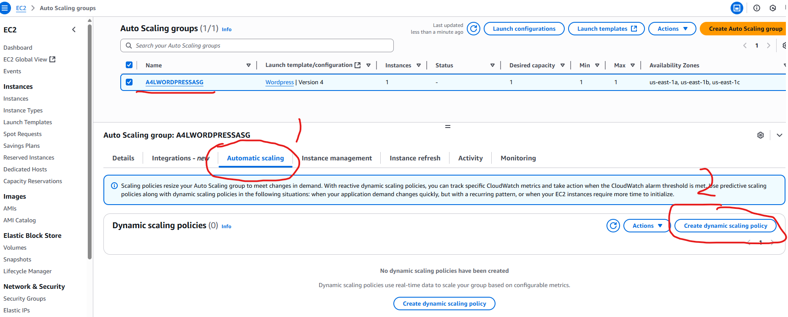
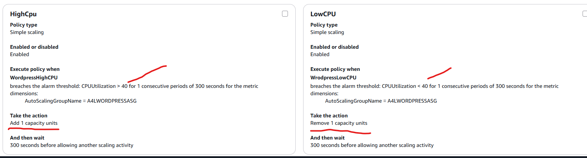

# Load Balancers

Servers that forward traffic to multiple instances

- Can Expose sinble point of access (DNS) to yuour application
- Handle failures of instances transparently to user

## ELB Elastic Load Balancer

- managed load balancer
- gauranteed to work, upgrades and maintenance are taken care of by AWS, high availability ensured
- Supports health checks

### Types of ELBs:

- Application Load Balancer - for applications on the web - Layer 7 HTTP HTTPS
- Network Load Balancer - High Performance balancer - gaming, millions of requests etc. Allows for TCP - Layer 4
- Classic Load Balancer - older generation and being retired - do not use this. Layer 4 and 7.
- Gateway Load Balancer - newer balancer added in 2020
- Best practice when setting up load balancers is to deploy them across at least 3 Availability Zones for high availability

**Target Group:**

- when setting up a load balancer you need to specify a target group which is basically grouping the EC2 instances or endpoints you want the LB to direct traffic to.
- Target groups cost no money to keep around (instances assigned to them do though)

### Use with containers/ECS

- ELBs can be used to provide a static reliable address when deploying containers (the container's IP addr will change).

# Multi Tiered Architecture with Load Balancers

- Use Load Balancers between each tier of the App (i.e. Web, App, Database tiers) to abstract one tier from another
- This solves the problem of the tiers having to communicate with specific instances between tiers which could result in disruption of service if scaling or instances change
- The user communicates with the web app via an ELB node. The ELB node connects to an instance, but the user does not know which instance.
  - The web tier would then communicate with the other tiers via an internal Load Balancer

### Main advantage

- Using Load Balancers to abstract communication between tiers loosens coupling between tiers and allows the different tiers to **scale independently of each other**

### Cross-Zone Load Balancing

- A Load Balancer by default has at least one node per Availability Zone which it's configured for
- Cross-Zone LB is a feature that allows the Load Balancer to distribute load across all instances in all Availability Zones (i.e. to instances in other AZs the Load Balancer is not in)
  - Historically, the ELBs could only distribute to instances in the same AZ they were in which caused uneven loads.
- This feature is enabled as standard default when you deploy Load Balancers

### Provisioning ELBs

- Seen as one device which runs in two or more AZs (in one subnet in each of the availability zones)
  - Under the hood there are actually multiple ELB Nodes created in the subnet for each AZ that the Load Balancer is configured for
- A DNS Record is created for the Load Balancer which spreads the incoming requests over all the active Nodes for that Load Balancer
- ELB Nodes (i.e. starting at one per subnet per AZ) will scale automatically if additional load is placed on them
- Configured via **Listener Configurations** which control what the Load Balancer listens to
- **Require 8 or more free IP Addresses per subnet that they get deployed into**
  - Recommended is to use `/27` CIDR addressed subnets to allow scaling

#### Two Types of Load Balancers

- Internet Facing: allocated with public IPv4 addresses
- Internal: Only allocated private IP Addresses
- NOTE: **EC2 Instances do not need to be public to work with Load Balancers**
  - Load Balancers can connect with public or private EC2 instances

# ALBs and NLBs

- Note: Avoid Classic Load Balancers - issues with Scaling and not supporting SNI, every unique https name requires an individual classic load balancer
- v2 Load Balancers support Rules and Target Groups as well as SNI, and an ALB allows consolidation

## Application Load Balancers

- True Layer 7 Load Balancer configured to listen on `HTTP` or `HTTPS` protocols
  - **ALBs cannot understand and work with any other protocols like `SMTP` or `SSH`**
  - Cannot be configured to listen to `TCP`, `UDP` or `TLS`
- Understands layer 7 attributes such as content type, custom headers, cookies, user location and app behavior
  - The ALB can inspect all of this information for Layer 7 and make decisions based on it (The Network Load Balancer cannot do this)
- **Connections are ALWAYS TERMINATED at the load balancer!**
  - You cannot have an unbroken connection from the customer through to the instances/application
  - The connection is always terminated and a new connection is made from the Load Balancer to the application infra
  - This could be a security limitation because end-to-end SSL encryption is not possible between the client and application instances
- All Load Balancers which use `HTTPS` must have a certificate installed on that load balancer
- ALBs are slower than Network Load Balancers (NLBs) due to additional layers on the networking stack
- ALBs can make Health Checks to the application directly due to layer 7 access to check if the app is running correctly, etc.

### ALB Rules

- Rules direct connections that arrive at a Listener
- Rules are processed in priority order
  - Always the last rule to be processed is the default rule `catchall`
- Rule Conditions:
  - host-header
    http-header
  - path-pattern
  - http-request-method
  - query-string
  - source-ip
- Rule Actions:
  - forward
  - redirect
  - fixed-response
  - authenticate-oidc
  - authenticate-cognito

## Network Load Balancers (NLBs)

- Layer 4 Load Balancers which can interpret `TCP`, `TLS`, `UDP` protocols
- No visibility or understanding of `HTTP` or `HTTPS`
  - No session stickiness
  - Cannot interpret cookies or headers
- Extremely Fast - high performance with millions of requests per second and have about 25% the latency of ALBs
- Ideal for non HTTP/HTTPS protocols: `SMTP`, `SSH`, game servers, financial apps
- Health checks are limited: only can check ICMP or basic TCP Handshaking (no app awareness)
- Can be allocated Static IP Addresses - useful for whitelisting (i.e. for corporate clients)
- Can forward TCP to instances for an unbroken encrypted connection
  - Any connections using layers above layer 4 built on top of TCP (i.e. https on layer 7) are not interrupted like with the ALB
  - You need to use a TCP Listener with the NLB for this
- NLBs are used with private link to provide services to other VPCs

## Using a ALB vs. NLB

- Decide if there is any reason specifically for an NLB, otherwise default to using an ALB

### When to use a NLB:

- Unbroken encryption
- Static IPs for whitelisting
- Best Performance - fastest
- Using protocols that are not HTTP or HTTPS
- Privatelink usage

### When to use ALB:

- If none of the above requirements, then just use an ALB - should be the default one to use

## Auto Scaling Groups

- See [AutoScalingGroups.md](./AutoScalingGroups.md)

## Implementing a Load Balancer

[Video](https://learn.cantrill.io/courses/1101194/lectures/27895189)

- Needs a VPC, and subnets it will be placed into
  - i.e. 3 AZs in 3 PUBLIC subnets (1 in each AZ)
- Need a security group (do not use the default)
- Make sure the Listeners and routing open up HTTP traffic
- Create a target group where the LB forwards traffic to
  - Target type: `Instances`
  - You can add instances to the Target Group later manually or can integrate with an ASG
- Store the DNS name of the load balancer in Parameter Store to expose it to all the EC2 instances
  - Can store as a regular string
  - You need to configure this DNS name to be the home address for the application
    - For example, use ssm client to pull the DNS name from parameter store
- Finally you can create an ASG group to use with the ALB
  - [Demo](https://learn.cantrill.io/courses/1101194/lectures/27895190) at timestamp 2:00
  - Use a Launch Template with the ASG (select the Launch Template you want to use)
  - Can specify the version of the template
  - Specify the VPC and subnets for the ASG (3 subnets in 1 AZ each for example)
  - ASG will add any instances that are created or terminated in it to the target group the ALB is using (select the target group you created for the ALB in ASG setup)
    - You can alternatively manually assign instances to a target group that the ALB is using
  - Use the ELB Health checks which are more feature rich than regular health checks
  - Make sure to enable group metrics collection to CloudWatch for the ASG
  - Choose Min, Desired, Max of 1:
     
    
     
     
  - Add tags so you can identify the instances in the ASG easily:
     
    
     
     
  - Look at the Activity tab in the ASG details page to get information on status:
     
    
     
     
  - The ASG should now maintain one instance up and running from now on and is linked to the target group/ALB
- Add Dynamic Scaling to the ASG - generally use Simple Scaling Policies and associate them with an Alarm and Metric
   
  
   
   
  - Example policy:
    - CPUUtilization (EC2 metric by ASG) is higher than 40%, then add 1 insance
    - CPUUtilization (EC2 metric by ASG) is lower than 40%, then remove 1 insance
    - MAKE SURE TO INCREASE THE MAXIMUM CAPACITY OF THE ASG TO MORE THAN 1! (for example make it 3)
       
      
       
       
    - You can test the scaling using a tool like `stress` by sshing into the instance and running it: 
      - CPU stress: `stress -c 2 -v -t 3000`
      - Disk space stress: `stress -c 2 --hdd 1 -v -t 3000`
