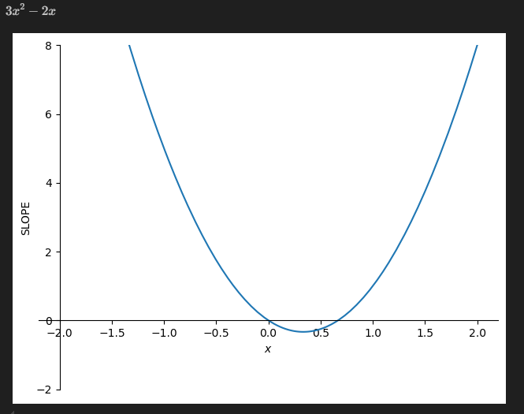

# Derivatives

See [Python Notebook](./derivatives.ipynb)

- The slope of the line of a function as the Limit of change approaches 0

### Note on Differentiation vs. Derivates

- Derivative: The instantaneous slopes (i.e. at each point)
- Differentiation: The process and the technique of getting the derivative

## Notation

- the Delta greek letter represents a change in some quantity:$\Delta x \over \Delta y$
  - or it's lowecase variant: $\delta x \over \delta y$
- Leibniz and Lagrange are the most common forms

### Leibniz notation

- df = change of function and sometimes the function is written outside the ratio notation as well: $${dy \over dx} = {df \over dx} = {d \over dx}f(x)$$
  - Higher order derivative notation: ${d^2y} \over {dx^2}$
- Chain Rule: $${dy \over dx} = {dy \over du} \times {du \over dx}$$

### Lagrange Notation

- More compact than Leibniz (f prime of x is the derivative) $$f'(x) = f' = fx$$
- second derivative or partial derivatives: $f'' = fxx$

### Newton Notation

- Simple - use a dot on top of the dependent variable (second derivate uses double dot)
- Commonly used to notate derivatives of physical forces over time (physics)
  $$\dot{y} \quad \ddot{y}$$

### Euler Notation

- Least commonly used, is a Capital D in front of the function:
  $$Df = Df(x) \quad D^2f \text{(second derivative)}$$

## The Slope of a Line

- **A Ratio** of the distance along the y-axis between two points over the distance along the x-axis. That ratio is the **Slope**.
- The change in `y` (output) over the change in `x` (input)
  - How much the dependent variable $y$ changes given some change in the independent variable $x$
- A higher ratio/number means that the slope is steeper, a smaller ratio means that the slope is less steep and more gradual

### Line function

- A line expressed as a function is:
  $$f(x) = mx + b$$
- $m$ is the slope parameter and $b$ is the `Intercept`

#### The Intercept: Where the line crosses the y-axis when input $x = 0$ in the function.

- The Intercept is unimportant for the Derivative - we only care about the $m$ slope parameter

### Computing the Slope parameter $m$

- The change in the $y$ axis values normalized by the change in the $x$ axis values

  - Take the difference between the y-axis of 2 points on a line and divide it by the difference of the x-axis coordinates for those points
    $$m = {{y_2 - y_1} \over {x_2 - x_1}} = {\Delta y \over \Delta x}$$

- You will also see the slope formula as the change of a function where $x$ plus a small change in $x$ minus the function with just $x$ over the change in $x$:
  $$m = {{f(x + \Delta x) - f(x)} \over \Delta x}$$
- or using $h$ in place of $\Delta x$:
  $$m = {{f(x + h) - f(x)} \over h}$$

#### Special Slope Properties of Straight Lines

- **NOTE:** No matter what $x$ value or $h$ you use for getting the slope of a straight line, you will always get the same slope result. A property of straight lines is: the slope anywhere is the slope everywhere
- The global slope is the same as the local slope (of a line segment)
- These properties hold true for the derivative of straight lines as well

### The Slope as it relates to the Derivative

- If we continue to chop up a portion of a line between two points into smaller and smaller line segments to get the Limit as the distance on the x-axis between those segments goes to 0
- The distance between two points along the x-axis $\Delta x$ as it gets smaller and smaller arbitrarily close to $0$ without actually being $0$ (then we would have ${\Delta x \over \Delta y} = {0 \over 0}$)
- At the limit as the segments get smaller and smaller towards 0 length (but not 0), we have a **slope series** (i.e. a vector of slopes for each chopped up line segment) - this is the Derivative
  - The slope series becomes the derivative when the segments are so numerous that the distances between them is almost 0

## The Derivative

- The derivative is **the Limit** as a change in the input $h$ goes to $0$
  - In other words, as the change of $x$ is an "infinitesimal" or very close to $0$
- Or the Slope of a line segment as the x-axis distance (x coords of the two end points) goes to $0$
  - How the function behaves or what it moves towards as $h$ gets closer and closer to $0$
- (Note: when $h$ goes to $0$ you have a undefined limit since you cannot divide by $0$ and need to use techniques to do differentiation to get around this)
  $${dy \over dx} = \lim_{h \to 0}\left[{{f(x+h)-f(x)} \over h} \right]$$

### Slope vs. Derivative

- "Slope": when $\Delta x$ is relatively large
- "Derivative": when $\Delta x$ is infinitesimal and very tiny and arbitrarily close to $0$ without actually getting to $0$ (i.e. infinitesimal)
  - **The Slope gotten from the Derivative can change at each infinitesimal change of input $dx$**

### Getting around dividing by 0

- Use algebraic expansions like the distributive property to expand the equations out and cancel out terms to help get a solution (as the limit goes to 0)
- **The Distributive Property:**
  For any number a and terms b and c:
  $$a(b + c) = ab + ac$$
  This rule applies to any number of terms inside the parentheses. For instance:
  $$a(b + c + d) = ab + ac + ad$$

#### Expansion:

Algebraic expansion for the func: $(2(x+h) + 5) - (2x+5)$:

1. Distribute the 2 in the first parenthesis: $(2x + 2h + 5) - (2x + 5)$

Now we have removed all nested parentheses.

2. The next step is to subtract the second set of parentheses from the first.

When subtracting expressions in parentheses, we change the operation for all terms inside the second parenthesis. In this case, subtraction becomes addition, and addition becomes subtraction:$(2x + 2h + 5) + (-2x - 5)$

3. Now we can remove the parentheses completely:2x + 2h + 5 - 2x - 5

4. Finally, we combine like terms:

The $2x$ and $-2x$ cancel out.
The $5$ and $-5$ cancel out.
The $2h$ remains and is the final simplified expression.

#### Expanding binomials - For any binomial $(a + b)^2$:

This expansion is also known as the "FOIL" method when applied to multiplying two binomials, as $(a + b)^2$ is equivalent to $(a + b)(a + b)$.

### Example computing the Derivative for $x^2$

$$f(x) = x^2$$
$${dy \over dx} = \lim_{h \to 0}\left[{{(x+h)^2 - x^2} \over h} \right]$$

- Expand algebraically with the goal of getting around having to divide by $0$:
  $$= \lim_{h \to 0}\left[{{x^2+2xh+h^2-x^2} \over h} \right]$$
- $x^2$ cancels out, then factor out $h$:
  $$= \lim_{h \to 0}\left[ {{h(2x+h)} \over h} \right]$$
- $h$ cancels out:
  $$= \lim_{h \to 0}\left[ 2x + h\right]$$
- We now don't have to worry about divide by $0$, just use the plugin method by setting $h$ to $0$:
  $${dy \over dx} = 2x$$
- The slopes of the tiny line segments change for different values of $x$ (as opposed to a straight line where the derivative and slope is constant)
  - We leave $x$ as a variable because we want to allow for different slope values depending on $x$
  - The slope of the function when $x=0$ is $0$, when $x=1$, the slope is $2$, etc.

### Differentiation is a LINEAR Operation

- Scalar multiples and additive terms in a function can be differentiated separately and summed to get the derivative of the entire function (the same result if you differentiated the entire function and not the separate terms individually).
  - You can differentiate the terms with the independent variable (i.e. $x$ for example) and pull out the constants
- You can take the differentiation of separate additive terms in a function and add them all together to get the derivative of the entire function
- Example: Scalars $a$ and $b$ are scalar multipliers of two functions $f(x)$ and $g(x)$ which are terms in a whole complete function we are differentiating:
  $${d \over dx} \left[af(x) + bg(x) \right]$$
- Because Differentiation is linear, we can differentiate the two function terms in the original function separately, then multiply those DERIVATIVES of the two functions by the scalars $a$ and $b$, take the sum and the result is exactly the same as getting the derivative for the entire function:
  $$af'(x) + bg'(x) = {d \over dx} \left[af(x) + bg(x) \right]$$

#### Multiplier scalars with the Linearity Property of Differentiation

- $a$ is a constant and $x^2$ is a term in the entire function.
- We can take the derivative of the term being multiplied by the constant and multiply the scalar constant by it to arrive at the same result as the derivative for the entire function
  $${d \over dx}\left(ax^2\right) = a\left({d \over dx}x^2\right)$$

## Geometry of Derivatives

### Secant and Tangent lines

- Descriptions of straight lines that pass through functions
- Secant line: passes through two points in a function (that are not infinitessinally close to each other)
- Tangent line: a line that passes through two points in a function which are infinitessimally close to each other (looks like it's grazing one point of the function graph)

### Geometric definition of a Derivative

- The slope of the Tangent Line at some point $x$ on a function $f(x)$
  - The tangent line passes through two points that are infinitessimally close to each other on the x-axis
  - Or the tangent is what you get when you take a Secant Line starting at $x$ and crossing through some other point on the function graph and you bring the distance of the points smaller and smaller to 0 (The limit as the distance $\Delta x$ approaches 0)

## Interpreting Derivative Plots

- **Shows the slope of a function at each point**, not the value (output) of the function - it shows you how the function is CHANGING
- A Derivative plot is a plot of the Tangent Line (a pair of infinitesimally close points on the function) at each x-axis point
- Two features to look for in Derivative Plots:
  - The sign of the derivative (is it positive or negative) tells you where the function is going up or going down
  - Where does the derivative cross 0? Those are critical points where the function changes direction. Indicates that the function is doing something qualitatively different.

### Example of a Derivative plot that is more complicated

- For the function $x^3 - x^2$, the slope of the function goes up and down and back up
- The derivative plot for this function looks like $x^2$, but you should interpret it as showing that the slope of the function is positive to start with, negative and then positive again
  - Note where the derivative plot crosses 0 on the y-axis at two points - these represent changes in direction of the function
     
    
     
- The derivative plot of $ln(x)$ - The first is the plot of the function and the plot below is the derivative plot.
  - The derivative plot shows us that the function is always going up (the derivative is always a positive number - y-axis on derivative plot)
  - The derivative plot also shows that the function starts with a high slope and then the slope starts decreasing so it is less and less steep
     
    
