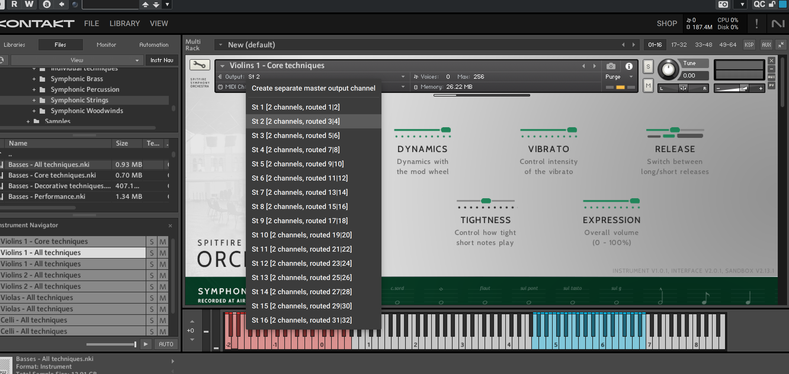
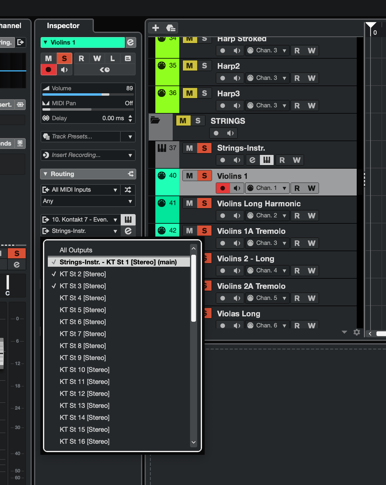
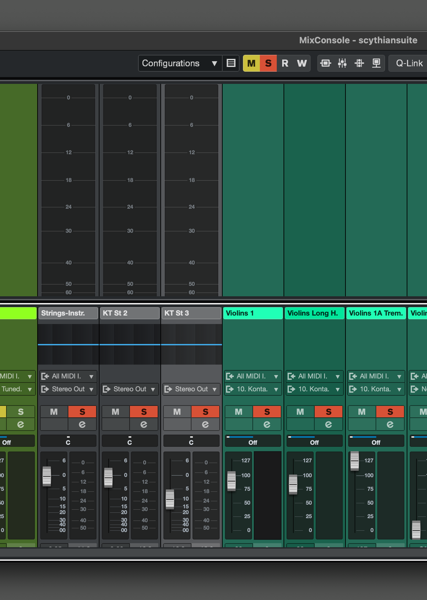

# Cubase

### Moving notes left and right

- click hold and select notes
  - CMD + <- or ->

### Full Screen Mixer

- press F3

## Create MIDI tracks from Instrument Track

- Create an Instrument Track
  - Select Kontakt
  - In Kontakt Player: View > Rack View on
  - Add multiple instruments by dragging from left to the bottom right screen section
  - Assign Channels to each instrument starting at 1 and incrementing (ex: Port A 1)
- Right click on Instrument Track in Cubase > Add Track > Midi Track
  - Leave settings alone (All Midi Tracks and Channel 1 selected)
  - Increment the number of tracks you want and enter a name
- Note: AFter this the Routing section in the inspector does show Any for the midi channel for the first entry, but the channel under the Instrument setting shows the number.

### MIDI Channels vs. Output Channels:

#### MIDI Channels (e.g., Ch. 1, Ch. 2):

- What They Do: MIDI channels tell Kontakt which instrument to play when you send MIDI data from Cubase. They’re like a remote control for triggering sounds.
- Where You Set Them: In Kontakt, you assign each instrument a MIDI channel (e.g., Violins on Ch. 1, Violas on Ch. 2) in the instrument header. In Cubase, you match this by setting your MIDI track’s channel to Ch. 1 for Violins, Ch. 2 for Violas, etc.
- Purpose: MIDI channels handle input—they decide which instrument responds to your notes or keyswitches.

#### Audio Channels (e.g., [3+4] in St. 2):

- What They Do: These are the output paths Kontakt uses to send the audio from each instrument to Cubase. Think of them as pipes carrying the sound after it’s triggered.
- Where You Set Them: In Kontakt’s Outputs panel, you define stereo pairs like St. 2 [3+4], St. 3 [5+6], etc., and assign instruments to them. Cubase then sees these as separate mixer channels.
- Purpose: Audio channels handle output—they determine where the sound goes for mixing (e.g., Violins to one mixer channel, Violas to another).

### Outputs

NOTE: You may need to restart Cubase if you do not see the new instrument created in the list!

- in Kontakt player > View > Outputs
  - Click Presets / Batch Configuration dropdown
  - Select Batch functions > Clear output selection and create one individual channel for each loaded instrument
  - Alternatively you can manually add channels and then set the output manually on the instrument in Kontakt player
- Set outputs to control the midi tracks individually
- Select Kontakt instrument (not the midi track)
- In left Channel tab, click the right arrow icon at the top and select outputs
  - i.e. select KT {instrument name}
  - these will be added to your mixer and represent each midi track so you can control volume and mix etc.

## Assigning Audio Outputs To MIDI Tracks for Mixer Control

[Good video](https://www.youtube.com/watch?v=KzW-vhu0p2k)

### Setup Outputs (Create Stereo outputs) in Kontakt:

- 64 mono/32 stereo outputs max allowed per kontakt instance
- In Kontakt instrument, go to View > check Show Outputs
- Click the plus sign in the mixer that shows up to get the outputs tab
- For stereo fader choose Quantity = 16 (how many faders, 16 for example), and Number of channels = 2 (num outputs per fader)
  - You can sum up to 16 channels into one fader track in the mixer
- Choose KT st. 1[1] for Host output
- Check "Ascending output assignment"
- Check "Delete existing channels before creating new ones"
- Finally, reset the Kontakt instance in Cubase
  - Try quitting and restarting Cubase/project
  - Alternatively Unload the instrument track in Cubase (right menu - VSTi) and reload it again

### Assign the instrument in the rack in Kontakt to one of the Stero Outputs

#### Start with St 2 (St 1 is the master stereo output and reserved)

 
 

#### Next, in Cubase select the MIDI Track, and in the Inspector on the left, under the Routing section in the select underneath the dropdown for "Kontakt 7" (should show name of Instrument track), select the KT St {number} you chose in the Kontakt instrument instance rack view for that track. (All other ones selected for other instruments will be checked as well)

- NOTE: if there is no Instrument selected, then open the dropdown and select the Kontakt instance for that MIDI track and then the new dropdown will appear to select the Stereo output.

 

 
 

#### Finally, go to the mixer (F3) and you should see the new faders for KT St 2, KT St 3 etc. - switch them off mute and you can control the volume of the MIDI track with these faders.

 

 
 

### Troubleshooting no sound but right channel is selected:

- Make sure the instrument track and the Midi Tracks are all Record Enabled (click the circle record button and make sure it is highlighted red)

## Optimizing RAM

- Purge samples (i.e. in Kontakt)
- Load instruments into a Rack instrument. See [vid](https://www.udemy.com/course/cubase-complete-course/learn/lecture/34818318#notes)
- Can create individual instrument tracks, but you need to disable them to save ram.

## Adding Pitch Bend Wheel to Instrument

- open your desired instrument patch in Kontakt and click on the little wrench icon in the top left corner of the instrument.
- Once you’re there, move your cursor to the right until you find "Edit all Groups". Click on that. It’ll turn red.
- Now for the final step. Mosey on down to the "Source" menu and click the "Mod" button. You might see some stuff there already. Don’t pay it any mind.
  - Move your cursor down to "add modulator ...". Under "External Sources", click on "pitch bend".
- You should now have pitch bend working with the wheel for that instrument.

## Keyboard Shortcuts

- Move to beginning of track: Shift-B
