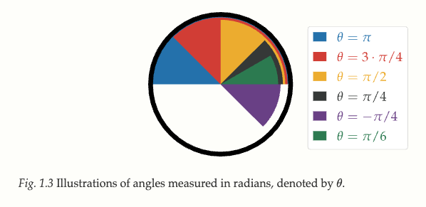
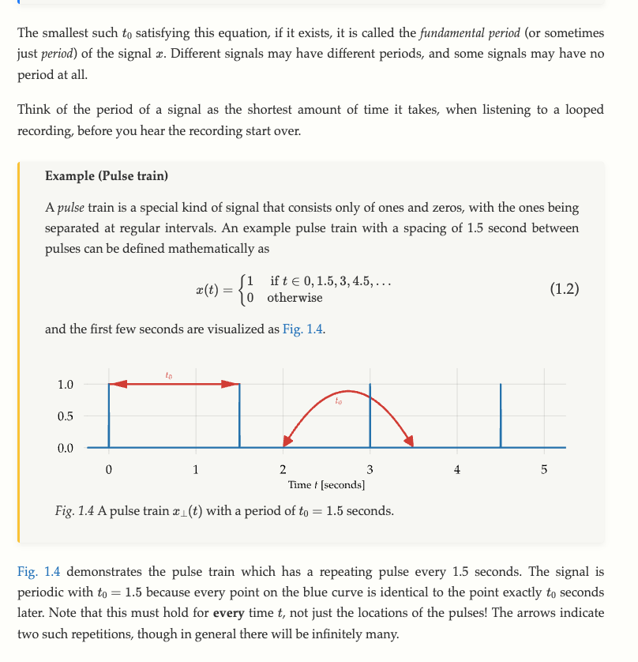
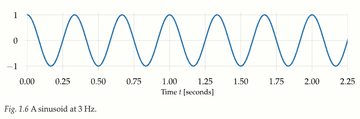
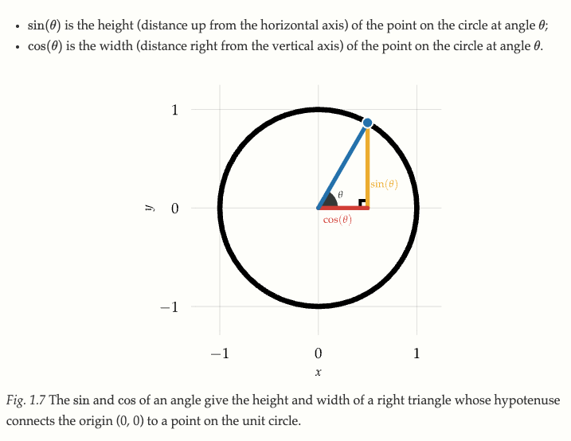
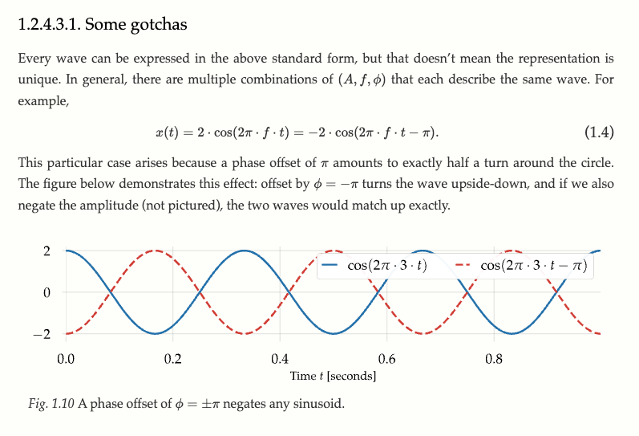

# Signal Basics

See [e-book - Digital Signals Theory](https://brianmcfee.net/dstbook-site/content/ch01-signals/Preliminaries.html)

- Signals convey information
- The important thing to measure in signals such as acoustics is the relative CHANGE in the signal (wave) and the units are less important.
  - In Audio processing the important thing is that the signal (voltages, etc.) can be converted somehow into air pressure changes that the ear can pick up.

### Notation

- see [Preliminaries chapter](https://brianmcfee.net/dstbook-site/content/ch01-signals/Preliminaries.html)
- Time-domain signal: $x(t)$ where $t$ is the time on the x axis, and $x$ is the signal on the y-axis
  - $x(t)$ is a **continuous-time** signal, $t$ can be any real number
  - $x[n]$ is a **discrete-time** signal - $n$ is an integer representing the n-th sample of signal $x$
    - Discrete time values are notated as $n$, $m$, or $k$
- $y = g(x)$: Apply some function $g$ to signal $x$ to produce output $y$ (example: a low pass filter on an audio signal to reduce high frequency content)
- Input signal: $x(t)$, output signal: $y(t)$ where $t$

#### Complex numbers

- $j = {\sqrt{-1}}$
- $z$ (or $w$) is a variable representing a complex number (with a real and imag. part)

#### Angles

- theta $\theta$ or phi $\phi$ notate angles
- Angles are in radians, not degrees
  - $2{\pi}$ = full rotation
  - $\pi$ = 180 deg
  - ${\pi}\over{2}$ = right angle 90 deg

 

 

## Periodicity

### Periodic Signals:

- Repeat at a specific time interval $t_0$
- If a signal is periodic, it must repeat forever.
   
  
   

### A-periodic Signals:

- No period or repeating pattern to the signal
- $t_0 = \infty$ -> i.e., you have to wait forever to see the signal repeat itself

### Fundamental Frequency

- How many cycles per one second: Hertz (HZ)
- $f_0$ = The fundamental frequency. a Pulse train that repeats every 3 seconds has a fundamental frequency of **2/3 Hz**
  - the subscript 0 denotes the fundamental vs. an overtone in the overtone series
- An aperiodic signal has a fundamental frequency of $f_0 = 0$

## Waves

### Sinusoids

- sine and cosine waves. These are the most important types of waves and behave well mathematically
   
  
   
- **Rotation models repitition** i.e. periods
  - Many examples in nature: revolving planets around the sun, the earth night and day cycle spin, moon orbiting the earth

### Sin and Cosine

- The Sine or Cosine turns angles into distances (from the origin to a reference point on the circle)
- Sine is vertical
- Cosine is horizontal

- Theta $\theta$ represents the angle of sin or cosine
- Convention: angle $\theta = 0$ is the right most point on the circle (y=0,x=1)
- Positive angles $\theta > 0$ represent counter-clockwise rotation up the circle
- Negative angles $\theta < 1$ represent clockwise rotation down the circle
   
  
   

#### Computing the cycle

- Assumes $\theta(t)$ keeps moving at a constant rate
- The fundamental period $t_0$ can be translated into a frequency with $f_0 = {1\over{t_0}}$

The following formulas translates the angles to x and y coordinates (cosine and sine). After $t = t_0$ seconds, $f_0 x t_0 = 1$, and the angle is at a complete rotation $\theta(t_0) = 2\pi = 0$.
- $t_0$ is the minimal fundamental time for a complete cycle in seconds=
- $x(t)$ and $y(t)$ represent $\theta(t)$
  $$
  \begin{align}
  x(t) = \cos{(2\pi \cdot f_0 \cdot t)} \\
  y(t) = \sin{(2\pi \cdot f_0 \cdot t)}
  \end{align}
  $$
- $2\pi$ is 2 pi radians (a complete rotation around the unit circle)

### Wave Parameters

- Generalized computation for describing every wave:
$$x(t) = A \cdot \cos(2\pi \cdot f \cdot t + \phi)$$

- $A$ is Amplitude, how it can rise or fall from 0, stretching or compressing the wave vertically, or interpertrated as radius of the circle
- $f$ is frequency, stretching or compressing the wave horizontally
- $\phi$ is the phase offset, starting position in radians at time $t = 0$
  - Has the effect of HORIZONTALLY shifting the wave. Positive $\phi$ moves the wave to the left and negative $\phi$ moves it to the right

#### Multiple descriptions are possible of the Same Wave:

 

 